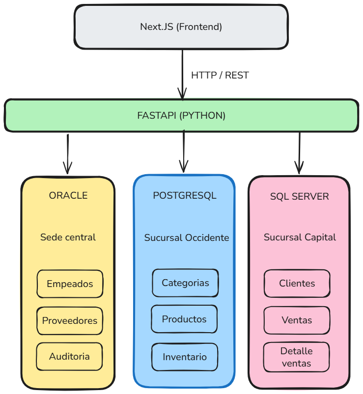
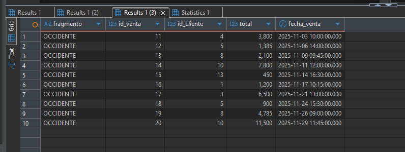
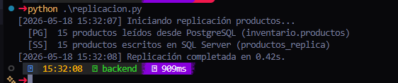

# Proyecto Final — Bases de Datos Distribuidas


## TecnoChapina S.A. — Mini Plataforma Empresarial de Ventas Distribuida

**Curso:** Base de Datos II
**Catedrático:** Ing. Angel Atilio Maltez C.
**Universidad:** Universidad Mariano Gálvez de Guatemala
**Fecha de entrega:** 2 de junio de 2026
**Estudiante:** _Jaime Israel Tuyuc Tzaj_
**Carné:** _1990-18-2320_

---

## Índice

1. [Descripción de la empresa](#1-descripción-de-la-empresa)
2. [Arquitectura distribuida](#2-arquitectura-distribuida)
3. [Distribución de datos por motor](#3-distribución-de-datos-por-motor)
4. [Modelo Entidad-Relación](#4-modelo-entidad-relación)
5. [Día 1 — Infraestructura Docker](#5-día-1--infraestructura-docker)
6. [Día 2 — Diagramas y modelo ER](#6-día-2--diagramas-y-modelo-er)
7. [Día 3 — Esquemas, usuarios y permisos](#7-día-3--esquemas-usuarios-y-permisos)
8. [Día 4 — Fragmentación y replicación](#8-día-4--fragmentación-y-replicación)
9. [Día 5 — Consultas distribuidas](#9-día-5--consultas-distribuidas)
10. [Día 6 — Interfaz de usuario](#10-día-6--interfaz-de-usuario)
11. [Ventajas, desventajas y problemas encontrados](#11-ventajas-desventajas-y-problemas-encontrados)
12. [Conclusiones y aprendizajes](#12-conclusiones-y-aprendizajes)

---

## 1. Descripción de la empresa

**TecnoChapina S.A.** es una empresa guatemalteca dedicada a la venta y distribución
de productos electrónicos: celulares, computadoras, accesorios y componentes.
Opera con tres sedes ubicadas en distintas regiones del país, y cada sede gestiona
una parte distinta del negocio bajo un motor de base de datos diferente. Esta
decisión refleja un escenario real, donde diferentes departamentos heredan o
adoptan tecnologías distintas según sus necesidades históricas.

### Sedes

| Sede | Ubicación | Motor | Responsabilidad |
|------|-----------|-------|-----------------|
| Central | Ciudad de Guatemala | **Oracle XE 21c** | Administración (empleados, proveedores, auditoría) |
| Sucursal Occidente | Quetzaltenango | **PostgreSQL 16** | Inventario (productos, categorías, stock) |
| Sucursal Capital | Zona 10, Guatemala | **SQL Server 2022** | Ventas (clientes, ventas, detalle de ventas) |

---

## 2. Arquitectura distribuida

TecnoChapina implementa un modelo **Hub-and-Spoke** donde Oracle (Sede Central)
actúa como nodo central administrativo, y PostgreSQL y SQL Server operan como
nodos periféricos especializados. La integración de datos entre los tres motores
se realiza a través de una capa de aplicación en Python (FastAPI) que orquesta
las consultas distribuidas y la replicación entre nodos.



### Componentes del sistema

- **Capa de datos:** tres motores corriendo en contenedores Docker aislados pero
  conectados por una red interna compartida (`bdd-net`).
- **Capa de integración:** servicio backend en **FastAPI (Python)** que se conecta
  a los tres motores y expone endpoints REST para la UI.
- **Capa de presentación:** aplicación web en **Next.js 15** con interfaz mínima
  para ejecutar las consultas distribuidas y visualizar los resultados con
  indicadores del motor de origen.

---

## 3. Distribución de datos por motor

### Oracle (Sede Central — Administrativo)

| Tabla | Descripción |
|-------|-------------|
| `empleados` | Personal de las tres sedes |
| `proveedores` | Proveedores de productos electrónicos |
| `auditoria` | Registro centralizado de operaciones críticas |

### PostgreSQL (Sucursal Occidente — Inventario)

| Tabla | Descripción |
|-------|-------------|
| `categorias` | Categorías de productos (celulares, laptops, accesorios) |
| `productos` | Catálogo completo de productos |
| `inventario` | Stock disponible por producto y bodega |

### SQL Server (Sucursal Capital — Ventas)

| Tabla | Descripción |
|-------|-------------|
| `clientes` | Clientes registrados de TecnoChapina |
| `ventas` | Cabecera de cada venta realizada |
| `detalle_ventas` | Líneas de detalle por venta |

---

## 4. Modelo Entidad-Relación


El diagrama fue generado con **dbdiagram.io** a partir del esquema de las 9 tablas distribuidas entre los tres motores. Las flechas sólidas representan **FK reales** (dentro del mismo motor); las referencias entre motores distintos son **lógicas** y se documentan en las notas de cada columna, dado que no pueden enforarse con FK nativas al cruzar motores diferentes.

---

## 5. Día 1 — Infraestructura Docker

### 5.1 Estructura de carpetas

```
proyecto-bdd-distribuida/
├── docker-compose.yml
├── .env.example
├── .gitignore
├── README.md
├── CONTEXTO_PROYECTO.md
├── docs/
│   ├── capturas/
│   ├── diagrama-arquitectura.png
│   └── modelo-er.png
├── sql/
│   ├── oracle/
│   ├── postgres/
│   └── sqlserver/
├── backend/                  # FastAPI
└── frontend/                 # Next.js
```


### 5.2 Configuración Docker Compose

El archivo `docker-compose.yml` levanta los tres motores en contenedores
independientes, conectados por una red interna `bdd-net`. Cada motor expone su
puerto estándar al host para permitir conexiones desde herramientas cliente como
DBeaver.

**Decisiones de diseño:**

- **Oracle:** se usa la imagen `gvenzl/oracle-xe:21-slim-faststart` (mantenida por
  un Product Manager de Oracle) en lugar de la imagen oficial, porque no requiere
  registro en Oracle Container Registry y arranca en aproximadamente 2 minutos.
- **PostgreSQL:** versión Alpine para minimizar el tamaño de la imagen (~80 MB).
- **SQL Server:** edición Developer (gratuita para entornos no productivos), con
  contraseña que cumple los requisitos de complejidad de Microsoft.
- **Healthchecks:** cada servicio incluye un healthcheck para confirmar cuándo
  está realmente listo para aceptar conexiones, no solo cuándo el contenedor
  inició.

### 5.3 Levantar la infraestructura

```powershell
docker compose up -d
docker compose ps
```


### 5.4 Verificación de conexiones

**Oracle:**

```powershell
docker exec -it bdd_oracle sqlplus system/OraclePass123@//localhost:1521/XEPDB1
```


**PostgreSQL:**

```powershell
docker exec -it bdd_postgres psql -U admin_inventario -d inventario_db
```


**SQL Server:**

```powershell
docker exec -it bdd_sqlserver /opt/mssql-tools18/bin/sqlcmd -S localhost -U sa -P "SqlServerPass123!" -C -Q "SELECT @@VERSION"
```


### 5.5 DBeaver como cliente unificado

Para administrar los tres motores desde una sola herramienta, se utiliza
**DBeaver Community Edition**. Se configuraron tres conexiones simultáneas:

| Conexión | Host | Puerto | Usuario | Base/Service |
|----------|------|--------|---------|--------------|
| Oracle Central | localhost | 1521 | system | XEPDB1 |
| Postgres Occidente | localhost | 5432 | admin_inventario | inventario_db |
| SQL Server Capital | localhost | 1433 | sa | master |

> Para SQL Server: en *Driver properties* agregar `trustServerCertificate=true`.


---

## 6. Día 2 — Diagramas y modelo ER

### 6.1 Diagrama de arquitectura

El diagrama muestra las tres capas del sistema:

- **Capa de presentación:** Next.js 15 se comunica con el backend vía HTTP/REST.
- **Capa de integración:** FastAPI (Python) centraliza todas las conexiones. Es el único componente que conoce las credenciales de los tres motores y orquesta las consultas distribuidas.
- **Capa de datos:** los tres motores corren en contenedores Docker aislados dentro de la red `bdd-net`. Cada motor es responsable exclusivo de su dominio de datos.

Ver diagrama completo en la sección [2. Arquitectura distribuida](#2-arquitectura-distribuida).

### 6.2 Modelo Entidad-Relación

El modelo ER cubre las 9 tablas distribuidas entre los tres motores. Puntos clave:

**FK reales (dentro del mismo motor):**

| Relación | Motor |
|---|---|
| `empleados.id_supervisor` → `empleados.id_empleado` | Oracle |
| `productos.id_categoria` → `categorias.id_categoria` | PostgreSQL |
| `inventario.id_producto` → `productos.id_producto` | PostgreSQL |
| `ventas.id_cliente` → `clientes.id_cliente` | SQL Server |
| `detalle_ventas.id_venta` → `ventas.id_venta` | SQL Server |

**Referencias lógicas cross-motor (sin FK, enforadas por la aplicación):**

| Campo | Apunta a | Motores |
|---|---|---|
| `productos.id_proveedor` | `Oracle.proveedores.id_proveedor` | PostgreSQL → Oracle |
| `ventas.id_empleado` | `Oracle.empleados.id_empleado` | SQL Server → Oracle |
| `detalle_ventas.id_producto` | `PostgreSQL.productos.id_producto` | SQL Server → PostgreSQL |

**Por qué `auditoria` no tiene FK con nadie:** la tabla de auditoría registra operaciones sobre cualquier tabla del sistema usando campos genéricos (`tabla_afectada VARCHAR`, `id_registro INTEGER`). Una FK la limitaría a apuntar a una sola tabla, lo que rompería su propósito genérico.

Ver modelo completo en la sección [4. Modelo Entidad-Relación](#4-modelo-entidad-relación).

---

## 7. Día 3 — Esquemas, usuarios y permisos

### 7.1 Oracle — Tablespace, usuario y permisos

Se creó el tablespace `ts_central` como espacio de almacenamiento dedicado para los datos administrativos de la Sede Central. El usuario `admin_central` (creado automáticamente por Docker) recibió cuota ilimitada sobre ese tablespace y los permisos necesarios para operar.

**Scripts ejecutados como SYSTEM:**

```sql
CREATE TABLESPACE ts_central
  DATAFILE '/opt/oracle/oradata/XE/XEPDB1/ts_central.dbf'
  SIZE 50M AUTOEXTEND ON NEXT 10M MAXSIZE 200M;

ALTER USER admin_central DEFAULT TABLESPACE ts_central;
ALTER USER admin_central QUOTA UNLIMITED ON ts_central;

GRANT CREATE SESSION, CREATE TABLE, CREATE SEQUENCE,
      CREATE VIEW, CREATE TRIGGER TO admin_central;
```


Las tres tablas (`empleados`, `proveedores`, `auditoria`) se crearon bajo el esquema de `admin_central` con `TABLESPACE ts_central`.


### 7.2 PostgreSQL — Esquema y rol

Se creó el esquema `inventario` para aislar las tablas del esquema `public` por defecto, y el rol `rol_inventario` con permisos de lectura y escritura sobre ese esquema.

```sql
CREATE SCHEMA IF NOT EXISTS inventario;
CREATE ROLE rol_inventario;
GRANT USAGE, CREATE ON SCHEMA inventario TO rol_inventario;
GRANT rol_inventario TO admin_inventario;
```

Las tres tablas (`categorias`, `productos`, `inventario`) se crearon bajo el esquema `inventario`.


### 7.3 SQL Server — Base de datos, login y rol

Se creó la base de datos `ventas_db`, el login `usr_ventas` a nivel de servidor, y el rol `rol_ventas` con permisos DML sobre el esquema `dbo`.

```sql
CREATE DATABASE ventas_db;
CREATE LOGIN usr_ventas WITH PASSWORD = 'VentasPass123!';
CREATE USER  usr_ventas FOR LOGIN usr_ventas;
CREATE ROLE  rol_ventas;
GRANT SELECT, INSERT, UPDATE, DELETE ON SCHEMA::dbo TO rol_ventas;
ALTER ROLE rol_ventas ADD MEMBER usr_ventas;
```

Las tres tablas (`clientes`, `ventas`, `detalle_ventas`) se crearon en `ventas_db` con el campo `sucursal_id` en `ventas` como eje de la fragmentación horizontal.

### 7.4 Datos seed

Se insertaron datos realistas de una empresa guatemalteca de electrónica:

| Motor | Tabla | Registros |
|---|---|---|
| Oracle | `empleados` | 10 (3 Central, 4 Occidente, 3 Capital) |
| Oracle | `proveedores` | 5 |
| Oracle | `auditoria` | 10 |
| PostgreSQL | `categorias` | 5 |
| PostgreSQL | `productos` | 15 |
| PostgreSQL | `inventario` | 15 |
| SQL Server | `clientes` | 15 |
| SQL Server | `ventas` | 20 (10 por sucursal) |
| SQL Server | `detalle_ventas` | 35 |


---

## 8. Día 4 — Fragmentación y replicación

### 8.1 Fragmentación horizontal

La tabla `ventas` en SQL Server ya contiene el campo `sucursal_id` que diferencia las ventas de cada sede. Sobre ese campo se crean dos vistas que simulan los fragmentos físicos que en un sistema real vivirían en servidores distintos.

**Script:** `sql/sqlserver/03_fragmentacion.sql` (ejecutar como `sa` en `ventas_db`)

```sql
-- Fragmento Capital (sucursal_id = 1)
CREATE OR ALTER VIEW dbo.ventas_capital   AS SELECT * FROM dbo.ventas WHERE sucursal_id = 1;

-- Fragmento Occidente (sucursal_id = 2)
CREATE OR ALTER VIEW dbo.ventas_occidente AS SELECT * FROM dbo.ventas WHERE sucursal_id = 2;
```

**Verificación del reparto:**

```sql
SELECT 'Capital'   AS sucursal, COUNT(*) AS total_ventas, SUM(total) AS ingresos
FROM dbo.ventas WHERE sucursal_id = 1
UNION ALL
SELECT 'Occidente', COUNT(*), SUM(total)
FROM dbo.ventas WHERE sucursal_id = 2;
```

Resultado esperado: 10 ventas por fragmento, montos distintos.



### 8.2 Por qué fragmentación horizontal y no vertical

La fragmentación **horizontal** divide la tabla por filas (cada fila va a un fragmento). La fragmentación **vertical** dividiría las columnas (parte de los atributos en un nodo, el resto en otro). Se eligió horizontal porque:

- El criterio natural de distribución es geográfico (por sucursal).
- Las consultas más frecuentes son por sucursal ("ventas del mes en Capital").
- No hay columnas de uso exclusivo por una sede que justifiquen partir el esquema.

### 8.3 Replicación snapshot (PostgreSQL → SQL Server)

El script `backend/replicacion.py` copia la tabla `inventario.productos` de PostgreSQL hacia una tabla `productos_replica` en SQL Server. Esto permite que el motor de ventas tenga el catálogo disponible localmente para las consultas distribuidas, sin tener que cruzar la red en cada query.

**Tipo de replicación:** snapshot — trunca y reinserta en cada ejecución.

**Por qué snapshot y no incremental:** para el tamaño del catálogo (~15 productos) la diferencia de rendimiento es irrelevante. El snapshot es más simple de implementar y de explicar, y cumple el mismo objetivo pedagógico.

#### Instalación de dependencias

```powershell
cd backend
pip install -r requirements.txt
copy .env.example .env
```

#### Ejecutar la replicación

```powershell
python replicacion.py
```

Salida esperada:
```
[2026-05-18 20:00:00] Iniciando replicación productos...
  [PG]  15 productos leídos desde PostgreSQL (inventario.productos)
  [SS]  15 productos escritos en SQL Server (productos_replica)
[2026-05-18 20:00:01] Replicación completada en 0.42s.
```

#### Verificar en SQL Server

```sql
USE ventas_db;
SELECT id_producto, nombre, precio_unitario, replicado_en FROM productos_replica;
-- Debe mostrar los 15 productos de PostgreSQL con timestamp de replicación
```



---

## 9. Día 5 — Consultas distribuidas

El backend FastAPI (`backend/main.py`) se conecta a los tres motores y orquesta las consultas en memoria Python. Cada endpoint devuelve un JSON con los datos y los motores que participaron.

### 9.1 Levantar el backend

```powershell
cd backend
uvicorn main:app --reload --port 8000
```

Documentación interactiva disponible en: `http://localhost:8000/docs`

### 9.2 Todos los endpoints

| Endpoint | Método | Descripción | Motores |
|---|---|---|---|
| `GET /q1` | GET | Ventas por sucursal con nombre de producto | SQL Server + PostgreSQL |
| `GET /q2` | GET | Inventario actual vs unidades vendidas | PostgreSQL + SQL Server |
| `GET /q3` | GET | Top productos más vendidos | SQL Server + PostgreSQL |
| `GET /q4` | GET | Desempeño de empleados en ventas | SQL Server + Oracle |
| `GET /q5` | GET | Reporte integrado — últimas 10 ventas | SQL Server + PostgreSQL + Oracle |
| `GET /catalogos` | GET | Datos de referencia para formularios | SQL Server + Oracle + PostgreSQL |
| `POST /ventas` | POST | Insertar nueva venta (demuestra fragmentación dinámica) | PostgreSQL + SQL Server |

### 9.3 Cómo funcionan las consultas distribuidas

Cada endpoint sigue el mismo patrón de tres pasos:

```
1. Consultar motor A  →  resultado_A (lista de filas)
2. Consultar motor B  →  resultado_B (diccionario indexado por PK)
3. Combinar en Python →  for fila in resultado_A: fila.update(resultado_B[fila.id])
```

No hay JOINs cross-motor. Los datos viajan por la red una vez por consulta y se ensamblan en memoria dentro del proceso Python. Esto es exactamente la **Opción B** de consultas distribuidas descrita en el plan del proyecto.

### 9.4 Descripción de cada consulta

**Q1 — Ventas por sucursal con nombre de producto**

SQL Server calcula las unidades vendidas e ingresos agrupados por producto y sucursal. PostgreSQL aporta el nombre del producto. El join se hace por `id_producto`.

**Q2 — Inventario actual vs unidades vendidas**

PostgreSQL trae el stock disponible por producto. SQL Server suma las cantidades vendidas. El resultado muestra la diferencia (stock - vendido) para detectar qué productos están en riesgo de quedarse sin existencias.

**Q3 — Top productos más vendidos**

SQL Server ordena los productos por unidades vendidas. PostgreSQL agrega el nombre y la categoría. Útil para decisiones de reabastecimiento.

**Q4 — Desempeño de empleados en ventas**

SQL Server agrupa las ventas por `id_empleado`. Oracle aporta el nombre, puesto y sede de cada empleado. Muestra cuánto generó cada vendedor.

**Q5 — Reporte integrado (los 3 motores)**

Las 10 ventas más recientes con nombre de cliente (SQL Server), nombre de producto (PostgreSQL) y nombre del empleado que atendió (Oracle). Es la consulta más compleja y la que mejor demuestra la integración de los tres motores.

### 9.5 Endpoints de soporte: catálogos e inserción de ventas

Además de las 5 consultas de lectura, el backend expone dos endpoints de soporte que alimentan la funcionalidad de inserción de ventas desde la UI.

**`GET /catalogos`**

Consulta los tres motores en paralelo y devuelve todos los datos de referencia necesarios para el formulario de nueva venta.

```json
{
  "clientes":   [{ "id": 1, "nombre": "Juan Pérez" }],
  "empleados":  [{ "id": 1, "nombre": "Ana López", "puesto": "Vendedora" }],
  "productos":  [{ "id": 1, "nombre": "Galaxy S24", "precio": 2399.99 }],
  "sucursales": [{ "id": 1, "nombre": "Capital" }, { "id": 2, "nombre": "Occidente" }]
}
```

Si uno de los motores no responde, devuelve lista vacía para ese campo y los demás se cargan igualmente.

**`POST /ventas`**

Registra una nueva venta en SQL Server en dos pasos:
1. Consulta el `precio_unitario` del producto en **PostgreSQL** (fuente de verdad del catálogo).
2. Inserta en `ventas` y `detalle_ventas` en **SQL Server**.

```json
// Body de la petición
{ "id_cliente": 3, "id_empleado": 2, "id_producto": 5, "cantidad": 2, "sucursal_id": 1 }

// Respuesta
{ "ok": true, "id_venta": 42, "sucursal": "Capital", "fragmento": "ventas_capital", "total": 4799.98 }
```

El campo `fragmento` en la respuesta muestra explícitamente en qué fragmento lógico quedó el registro. Como la fragmentación está implementada con vistas SQL (`WHERE sucursal_id = 1`), el nuevo registro aparece automáticamente en `ventas_capital` o `ventas_occidente` sin ningún paso adicional.


**Q1 — Ventas por sucursal con nombre de producto:**


**Q2 — Inventario actual vs unidades vendidas:**


**Q3 — Top productos más vendidos:**


**Q4 — Desempeño de empleados en ventas:**


**Q5 — Reporte integrado (los 3 motores):**


---

## 10. Día 6 — Interfaz de usuario

La interfaz se construyó con **Next.js 16** (App Router) y **Tailwind CSS 4**. Tiene dos secciones accesibles desde un tab bar: consultas distribuidas e inserción de nuevas ventas.

### 10.1 Levantar el frontend

```powershell
cd frontend
pnpm dev
```

Abrir: `http://localhost:3000`

> El backend debe estar corriendo en `http://localhost:8000` antes de usar la UI.

### 10.2 Tab — Consultas distribuidas

| Elemento | Descripción |
|---|---|
| Dropdown | Selecciona la consulta a ejecutar (Q1–Q5) |
| Badges de motores | Muestra qué motores participan en cada consulta (color por motor) |
| Botón Ejecutar | Llama al endpoint FastAPI y muestra los resultados |
| Tabla dinámica | Genera columnas automáticamente a partir de las claves del JSON |
| Indicador de estado | Muestra "Cargando…" durante la petición y el total de filas al terminar |

### 10.3 Tab — Nueva venta (fragmentación dinámica)

Permite insertar una nueva venta desde la UI y **demuestra que la fragmentación horizontal opera en tiempo real**: cualquier registro nuevo queda automáticamente en el fragmento correcto según la sucursal elegida.

**Campos del formulario:**

| Campo | Fuente de datos | Motor |
|---|---|---|
| Sucursal | Estático (Capital / Occidente) | — |
| Cliente | `GET /catalogos` | SQL Server |
| Empleado | `GET /catalogos` | Oracle |
| Producto | `GET /catalogos` | PostgreSQL |
| Cantidad | Número libre (mínimo 1) | — |

El precio se obtiene de PostgreSQL en el momento del registro. El `total` se calcula como `precio_unitario × cantidad`.

**Flujo completo:**

```
1. Abrir tab "Nueva venta"
2. Los dropdowns se cargan automáticamente desde /catalogos
3. Seleccionar sucursal, cliente, empleado, producto y cantidad
4. Click "Registrar venta"
5. La UI muestra:
      ✓ Venta #42 registrada en Capital
      Fragmento: [ventas_capital]
      Total: Q 4,799.98
      [Ver en Q1 →]
6. Click "Ver en Q1 →" → ejecuta Q1 automáticamente y el nuevo
   registro aparece en la tabla bajo la sucursal correcta
```

La fragmentación funciona porque `ventas_capital` y `ventas_occidente` son vistas SQL (`WHERE sucursal_id = 1/2`). No requieren mantenimiento: el INSERT es suficiente para que el registro aparezca en el fragmento correspondiente.

### 10.4 Estructura del frontend

```
frontend/
├── app/
│   ├── layout.tsx        # Título "TecnoChapina S.A. — BD2"
│   ├── page.tsx          # Toda la lógica: tabs, consultas y formulario
│   └── globals.css       # Tailwind 4 con @import "tailwindcss"
├── .env.local            # NEXT_PUBLIC_API_URL=http://localhost:8000
└── package.json          # Next.js 16, React 19, Tailwind 4 (pnpm)
```

### 10.5 Captura de la interfaz


---

## 11. Ventajas, desventajas y problemas encontrados

### 11.1 Ventajas observadas

**Especialización por motor:**
Cada motor hace lo que mejor sabe hacer. Oracle maneja datos administrativos con su sistema de usuarios, roles y tablespaces. PostgreSQL gestiona el inventario con sus tipos de datos avanzados. SQL Server procesa las transacciones de ventas. No se usa un solo motor "para todo" y eso refleja decisiones reales de arquitectura empresarial.

**Aislamiento de fallos:**
Si PostgreSQL (inventario) tiene un problema, las ventas en SQL Server siguen funcionando. Los sistemas no comparten el mismo proceso ni el mismo almacenamiento.

**Fragmentación horizontal útil:**
Las vistas `ventas_capital` y `ventas_occidente` permiten consultar ventas por región sin escanear toda la tabla. En un sistema real con millones de filas, esto reduce significativamente el tiempo de respuesta de reportes por sucursal.

**Réplica local acelera consultas:**
La tabla `productos_replica` en SQL Server evita cruzar la red hacia PostgreSQL en cada consulta de ventas. Una vez ejecutada la replicación, las consultas Q1, Q2 y Q3 son completamente locales al motor de ventas.

**Portabilidad del entorno:**
Docker Compose levanta los tres motores con un solo comando. Cualquier integrante del equipo (o el catedrático) puede reproducir el entorno exacto en su máquina sin instalar Oracle, PostgreSQL ni SQL Server de forma nativa.

---

### 11.2 Desventajas y limitaciones

**Sin transacciones ACID cross-motor:**
Si una venta se registra en SQL Server pero falla la actualización de inventario en PostgreSQL, no hay rollback automático. Resolver esto requiere protocolos como 2PC (Two-Phase Commit), que están fuera del alcance del proyecto.

**Sincronización manual:**
La replicación es por demanda: hay que ejecutar `replicacion.py` cada vez que cambia el catálogo de productos. En producción se usaría un job programado (cron, Task Scheduler) o replicación nativa del motor.

**Latencia adicional:**
Una consulta distribuida abre 2 o 3 conexiones TCP, ejecuta queries en paralelo y ensambla resultados en Python. Aunque funciona bien con ~50 registros, el overhead sería visible con millones de filas sin índices adecuados.

**Orquestación frágil:**
Si el backend FastAPI cae, toda la integración se pierde. No hay caché ni fallback. En producción se necesitaría un service mesh o al menos healthchecks con reinicio automático.

---

### 11.3 Problemas técnicos encontrados y cómo se resolvieron

| # | Problema | Causa | Solución |
|---|---|---|---|
| 1 | `psycopg-binary==3.2.0.dev1 not found` | El extra `[binary]` resolvía a una pre-release inexistente en PyPI | Fijar la versión a `psycopg[binary]==3.2.13` |
| 2 | `pyodbc.InterfaceError IM002` | El script usaba ODBC Driver 18, pero la máquina solo tiene Driver 17 | Verificar con `Get-OdbcDriver` en PowerShell y cambiar el string a `ODBC Driver 17 for SQL Server` |
| 3 | Oracle rechazaba la columna `cargo` | La columna real en `empleados` se llama `puesto`, no `cargo` | Leer `sql/oracle/02_tablas.sql` antes de escribir las queries del backend |
| 4 | Oracle tardaba en arrancar | Primera inicialización de XE tarda 1-3 minutos | Esperar el mensaje `DATABASE IS READY TO USE!` en los logs antes de conectar |
| 5 | SQL Server rechaza conexión sin `TrustServerCertificate` | Docker usa certificado SSL autofirmado | Agregar `TrustServerCertificate=yes` en el connection string de pyodbc |

---

## 12. Conclusiones y aprendizajes

### 12.1 Sobre las bases de datos distribuidas

Las bases de datos distribuidas no son una solución universal. Son la respuesta correcta cuando los datos tienen **propietarios distintos** (una sucursal no debería tener acceso total a los datos de otra), cuando los **volúmenes por dominio** justifican motores especializados, o cuando la **disponibilidad parcial** es preferible a la falla total del sistema.

En este proyecto, la distribución tiene sentido porque:
- El inventario (Occidente) y las ventas (Capital) son operaciones independientes.
- Los datos administrativos (Oracle/Central) deben estar centralizados y auditados.
- Ninguna sucursal necesita ver los datos completos de las demás para operar.

### 12.2 Sobre la integración sin linked servers

La decisión de usar Python como capa de orquestación en lugar de Database Links (Oracle) o Linked Servers (SQL Server) fue correcta para este entorno. Las ventajas fueron:

- **Sin configuración de red compleja:** los tres motores no necesitan verse entre sí, solo el backend Python los ve a todos.
- **Portabilidad:** el mismo código corre en Windows, Linux y Mac sin cambios.
- **Control total del JOIN:** se puede aplicar cualquier lógica de negocio antes de devolver el resultado, no solo SQL.

La desventaja es que el JOIN ocurre en memoria Python y no puede aprovechar los índices de los motores remotos. Para datasets grandes esto sería un cuello de botella.

### 12.3 Sobre la fragmentación y replicación

La fragmentación horizontal (vistas por `sucursal_id`) es la forma más simple de fragmentación, pero es suficiente para demostrar el concepto. Lo importante es entender **por qué se fragmenta**: para que cada nodo maneje solo los datos que le corresponden y las consultas locales sean más rápidas.

La replicación snapshot (copiar toda la tabla periódicamente) es la forma más básica de replicación. Funciona bien cuando los datos fuente cambian poco y la consistencia eventual es aceptable. No funciona si se necesita consistencia en tiempo real.

### 12.4 Aprendizajes clave

1. **Leer el esquema antes de escribir queries.** El error de `cargo` vs `puesto` se habría evitado revisando el DDL antes de asumir nombres de columnas.
2. **Verificar el entorno antes de codificar.** El driver ODBC disponible en la máquina determina qué string usar. No asumir que está instalada la versión más reciente.
3. **Docker simplifica la distribución del entorno**, pero no elimina la complejidad de los motores. Cada motor tiene sus propias reglas de autenticación, tipos de datos y dialectos SQL.
4. **La complejidad real de los sistemas distribuidos** está en la consistencia y el manejo de fallos, no en levantar los contenedores. Este proyecto simula la distribución pero no la hace tolerante a fallos.

---

## Anexo A — Cómo regenerar el entorno desde cero

```powershell
# Clonar el repositorio
git clone <url-del-repo>
cd proyecto-bdd-distribuida

# Levantar la infraestructura
docker compose up -d

# Esperar a que los healthchecks pasen (Oracle tarda ~2 min)
docker compose ps

# Cargar esquemas (los SQL de Oracle y Postgres se ejecutan automáticamente
# al primer arranque; SQL Server se carga manualmente)
docker exec -i bdd_sqlserver /opt/mssql-tools18/bin/sqlcmd `
  -S localhost -U sa -P "SqlServerPass123!" -C `
  -i /scripts/01_login_db.sql
```

## Anexo B — Exportar este documento a PDF

**Opción 1 — Extensión de VS Code (más rápido):**

1. Instalar la extensión **Markdown PDF** de yzane.
2. Abrir `README.md`, clic derecho → *Markdown PDF: Export (pdf)*.
