# Proyecto Final — Bases de Datos Distribuidas


## TecnoChapina S.A. — Mini Plataforma Empresarial de Ventas Distribuida

**Curso:** Base de Datos II
**Catedrático:** Ing. Angel Atilio Maltez C.
**Universidad:** Universidad Mariano Gálvez de Guatemala
**Fecha de entrega:** 5 de junio de 2026
**Estudiante:** _Jaime Israel Tuyuc Tzaj_
**Carné:** _1990-18-2320_

---

## Índice

1. [Descripción de la empresa](#1-descripción-de-la-empresa)
2. [Arquitectura distribuida](#2-arquitectura-distribuida)
3. [Distribución de datos por motor](#3-distribución-de-datos-por-motor)
4. [Modelo Entidad-Relación](#4-modelo-entidad-relación)
5. [Día 1 — Infraestructura Docker](#5-día-1--infraestructura-docker)
6. [Día 2 — Diagramas y modelo ER](#6-día-2--diagramas-y-modelo-er)
7. [Día 3 — Esquemas, usuarios y permisos](#7-día-3--esquemas-usuarios-y-permisos)
8. [Día 4 — Fragmentación y replicación](#8-día-4--fragmentación-y-replicación)
9. [Día 5 — Consultas distribuidas](#9-día-5--consultas-distribuidas)
10. [Día 6 — Interfaz de usuario](#10-día-6--interfaz-de-usuario)
11. [Ventajas, desventajas y problemas encontrados](#11-ventajas-desventajas-y-problemas-encontrados)
12. [Conclusiones y aprendizajes](#12-conclusiones-y-aprendizajes)

---

## 1. Descripción de la empresa

**TecnoChapina S.A.** es una empresa guatemalteca dedicada a la venta y distribución
de productos electrónicos: celulares, computadoras, accesorios y componentes.
Opera con tres sedes ubicadas en distintas regiones del país, y cada sede gestiona
una parte distinta del negocio bajo un motor de base de datos diferente. Esta
decisión refleja un escenario real, donde diferentes departamentos heredan o
adoptan tecnologías distintas según sus necesidades históricas.

### Sedes

| Sede | Ubicación | Motor | Responsabilidad |
|------|-----------|-------|-----------------|
| Central | Ciudad de Guatemala | **Oracle XE 21c** | Administración (empleados, proveedores, auditoría) |
| Sucursal Occidente | Quetzaltenango | **PostgreSQL 16** | Inventario (productos, categorías, stock) |
| Sucursal Capital | Zona 10, Guatemala | **SQL Server 2022** | Ventas (clientes, ventas, detalle de ventas) |

---

## 2. Arquitectura distribuida

TecnoChapina implementa un modelo **Hub-and-Spoke con fragmentación física real** donde:

- **Oracle XE 21c** es el nodo central administrativo (empleados, proveedores, auditoría) y actúa además como **nodo de backup/failover** para SQL Server.
- **PostgreSQL 16** gestiona el inventario y almacena físicamente las ventas de Sucursal Occidente (`sucursal_id = 2`).
- **SQL Server 2022** almacena físicamente las ventas de Sucursal Capital (`sucursal_id = 1`) junto con los clientes.

La integración entre los tres motores se realiza a través de una capa de aplicación en Python (FastAPI) que orquesta las consultas distribuidas, el routing de inserciones y la conmutación por error (failover).

### Fragmentación horizontal física

La tabla `ventas` está **fragmentada físicamente** entre dos motores distintos:

| Fragmento | Motor | Condición | Tablas |
|-----------|-------|-----------|--------|
| Capital | SQL Server (`ventas_db`) | `sucursal_id = 1` | `dbo.ventas`, `dbo.detalle_ventas` |
| Occidente | PostgreSQL (`inventario_db`) | `sucursal_id = 2` | `inventario.ventas`, `inventario.detalle_ventas` |

El backend decide en qué motor insertar o consultar en función del `sucursal_id` de cada operación. Ningún motor conoce la existencia del otro.

### Failover transparente (Oracle como backup de SQL Server)

Cuando se activa el modo failover (simulación de caída de SQL Server):

1. Las consultas de Capital se redirigen a las tablas de backup en Oracle (`ventas_backup`, `detalle_ventas_backup`).
2. Las nuevas ventas de Capital también se insertan en Oracle.
3. La UI muestra el motor activo pero el flujo de negocio continúa sin interrupción.

Ver diagramas completos en [`docs/arquitectura_v2.md`](docs/arquitectura_v2.md).


### Componentes del sistema

- **Capa de datos:** tres motores corriendo en contenedores Docker aislados pero conectados por una red interna compartida (`bdd-net`).
- **Capa de integración:** servicio backend en **FastAPI (Python)** que se conecta a los tres motores y expone endpoints REST para la UI. Contiene la lógica de routing por sucursal y el estado del failover.
- **Capa de presentación:** aplicación web en **Next.js 15** con tres tabs: consultas distribuidas, inserción de ventas y panel de sistema/failover.

---

## 3. Distribución de datos por motor

### Oracle (Sede Central — Administrativo + Backup)

| Tabla | Esquema | Descripción |
|-------|---------|-------------|
| `empleados` | `admin_central` | Personal de las tres sedes |
| `proveedores` | `admin_central` | Proveedores de productos electrónicos |
| `auditoria` | `admin_central` | Registro centralizado de operaciones críticas |
| `ventas_backup` | `admin_central` | Backup de ventas Capital (failover) |
| `detalle_ventas_backup` | `admin_central` | Backup de detalle_ventas Capital (failover) |

> Las tablas `ventas_backup` y `detalle_ventas_backup` se llenan bajo demanda con el endpoint `POST /backup-oracle`. En estado normal (sin failover) están vacías o contienen el último snapshot.

### PostgreSQL (Sucursal Occidente — Inventario + Ventas Occidente)

| Tabla | Esquema | Descripción |
|-------|---------|-------------|
| `categorias` | `inventario` | Categorías de productos |
| `productos` | `inventario` | Catálogo completo de productos |
| `inventario` | `inventario` | Stock disponible por producto y bodega |
| `ventas` | `inventario` | **Fragmento Occidente** — ventas `sucursal_id = 2` |
| `detalle_ventas` | `inventario` | Líneas de detalle de ventas Occidente |

### SQL Server (Sucursal Capital — Clientes + Ventas Capital)

| Tabla | Esquema | Descripción |
|-------|---------|-------------|
| `clientes` | `dbo` | Clientes registrados de TecnoChapina (todas las sedes) |
| `ventas` | `dbo` | **Fragmento Capital** — ventas `sucursal_id = 1` |
| `detalle_ventas` | `dbo` | Líneas de detalle de ventas Capital |

---

## 4. Modelo Entidad-Relación

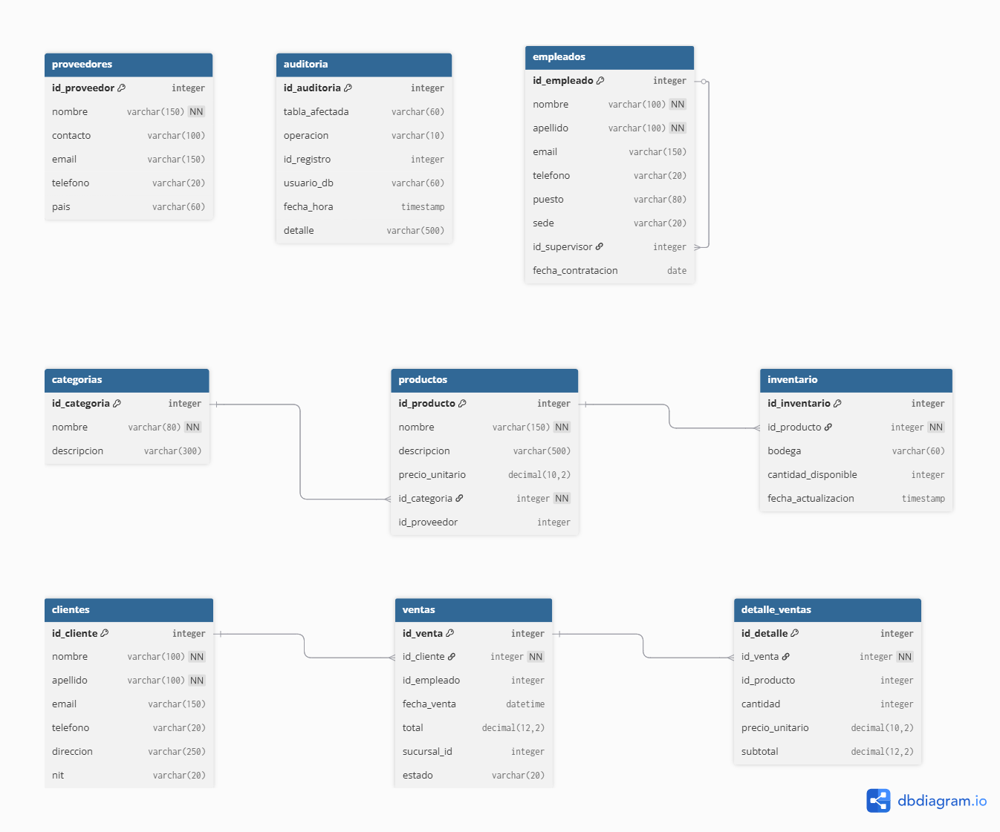

El diagrama fue generado con **dbdiagram.io** a partir del esquema de las 9 tablas distribuidas entre los tres motores. Las flechas sólidas representan **FK reales** (dentro del mismo motor); las referencias entre motores distintos son **lógicas** y se documentan en las notas de cada columna, dado que no pueden enforarse con FK nativas al cruzar motores diferentes.

---

## 5. Día 1 — Infraestructura Docker

### 5.1 Estructura de carpetas

```
proyecto-bdd-distribuida/
├── docker-compose.yml
├── .env.example
├── .gitignore
├── README.md
├── CONTEXTO_PROYECTO.md
├── docs/
│   ├── capturas/
│   ├── diagrama-arquitectura.png
│   └── modelo-er.png
├── sql/
│   ├── oracle/
│   ├── postgres/
│   └── sqlserver/
├── backend/                  # FastAPI
└── frontend/                 # Next.js
```

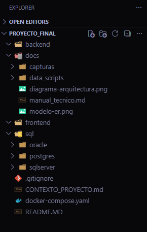

### 5.2 Configuración Docker Compose

El archivo `docker-compose.yml` levanta los tres motores en contenedores
independientes, conectados por una red interna `bdd-net`. Cada motor expone su
puerto estándar al host para permitir conexiones desde herramientas cliente como
DBeaver.

**Decisiones de diseño:**

- **Oracle:** se usa la imagen `gvenzl/oracle-xe:21-slim-faststart` (mantenida por
  un Product Manager de Oracle) en lugar de la imagen oficial, porque no requiere
  registro en Oracle Container Registry y arranca en aproximadamente 2 minutos.
- **PostgreSQL:** versión Alpine para minimizar el tamaño de la imagen (~80 MB).
- **SQL Server:** edición Developer (gratuita para entornos no productivos), con
  contraseña que cumple los requisitos de complejidad de Microsoft.
- **Healthchecks:** cada servicio incluye un healthcheck para confirmar cuándo
  está realmente listo para aceptar conexiones, no solo cuándo el contenedor
  inició.

### 5.3 Levantar la infraestructura

```powershell
docker compose up -d
docker compose ps
```

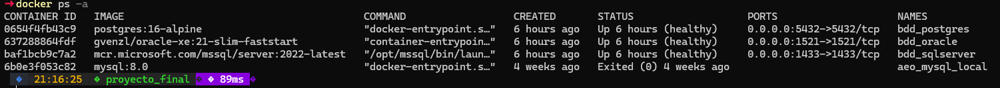

### 5.4 Verificación de conexiones

**Oracle:**

```powershell
docker exec -it bdd_oracle sqlplus system/OraclePass123@//localhost:1521/XEPDB1
```

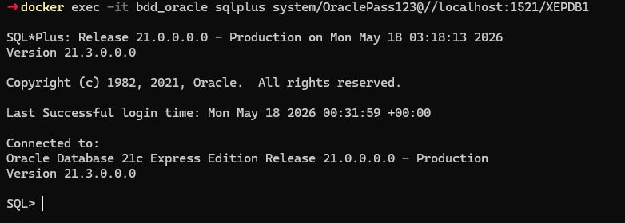

**PostgreSQL:**

```powershell
docker exec -it bdd_postgres psql -U admin_inventario -d inventario_db
```

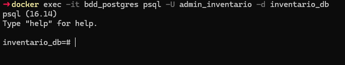

**SQL Server:**

```powershell
docker exec -it bdd_sqlserver /opt/mssql-tools18/bin/sqlcmd -S localhost -U sa -P "SqlServerPass123!" -C -Q "SELECT @@VERSION"
```

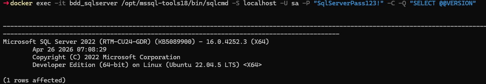

### 5.5 DBeaver como cliente unificado

Para administrar los tres motores desde una sola herramienta, se utiliza
**DBeaver Community Edition**. Se configuraron tres conexiones simultáneas:

| Conexión | Host | Puerto | Usuario | Base/Service |
|----------|------|--------|---------|--------------|
| Oracle Central | localhost | 1521 | system | XEPDB1 |
| Postgres Occidente | localhost | 5432 | admin_inventario | inventario_db |
| SQL Server Capital | localhost | 1433 | sa | master |

> Para SQL Server: en *Driver properties* agregar `trustServerCertificate=true`.

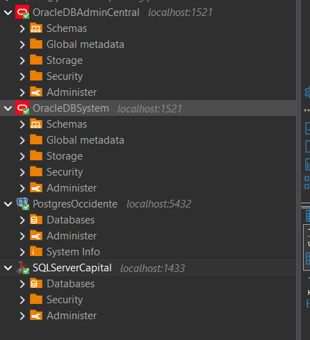

---

## 6. Día 2 — Diagramas y modelo ER

### 6.1 Diagrama de arquitectura

El diagrama muestra las tres capas del sistema:

- **Capa de presentación:** Next.js 15 se comunica con el backend vía HTTP/REST.
- **Capa de integración:** FastAPI (Python) centraliza todas las conexiones. Es el único componente que conoce las credenciales de los tres motores y orquesta las consultas distribuidas.
- **Capa de datos:** los tres motores corren en contenedores Docker aislados dentro de la red `bdd-net`. Cada motor es responsable exclusivo de su dominio de datos.

Ver diagrama completo en la sección [2. Arquitectura distribuida](#2-arquitectura-distribuida).

### 6.2 Modelo Entidad-Relación

El modelo ER cubre las 9 tablas distribuidas entre los tres motores. Puntos clave:

**FK reales (dentro del mismo motor):**

| Relación | Motor |
|---|---|
| `empleados.id_supervisor` → `empleados.id_empleado` | Oracle |
| `productos.id_categoria` → `categorias.id_categoria` | PostgreSQL |
| `inventario.id_producto` → `productos.id_producto` | PostgreSQL |
| `ventas.id_cliente` → `clientes.id_cliente` | SQL Server |
| `detalle_ventas.id_venta` → `ventas.id_venta` | SQL Server |

**Referencias lógicas cross-motor (sin FK, enforadas por la aplicación):**

| Campo | Apunta a | Motores |
|---|---|---|
| `productos.id_proveedor` | `Oracle.proveedores.id_proveedor` | PostgreSQL → Oracle |
| `ventas.id_empleado` | `Oracle.empleados.id_empleado` | SQL Server → Oracle |
| `detalle_ventas.id_producto` | `PostgreSQL.productos.id_producto` | SQL Server → PostgreSQL |

**Por qué `auditoria` no tiene FK con nadie:** la tabla de auditoría registra operaciones sobre cualquier tabla del sistema usando campos genéricos (`tabla_afectada VARCHAR`, `id_registro INTEGER`). Una FK la limitaría a apuntar a una sola tabla, lo que rompería su propósito genérico.

Ver modelo completo en la sección [4. Modelo Entidad-Relación](#4-modelo-entidad-relación).

---

## 7. Día 3 — Esquemas, usuarios y permisos

### 7.1 Oracle — Tablespace, usuario y permisos

Se creó el tablespace `ts_central` como espacio de almacenamiento dedicado para los datos administrativos de la Sede Central. El usuario `admin_central` (creado automáticamente por Docker) recibió cuota ilimitada sobre ese tablespace y los permisos necesarios para operar.

**Scripts ejecutados como SYSTEM:**

```sql
CREATE TABLESPACE ts_central
  DATAFILE '/opt/oracle/oradata/XE/XEPDB1/ts_central.dbf'
  SIZE 50M AUTOEXTEND ON NEXT 10M MAXSIZE 200M;

ALTER USER admin_central DEFAULT TABLESPACE ts_central;
ALTER USER admin_central QUOTA UNLIMITED ON ts_central;

GRANT CREATE SESSION, CREATE TABLE, CREATE SEQUENCE,
      CREATE VIEW, CREATE TRIGGER TO admin_central;
```

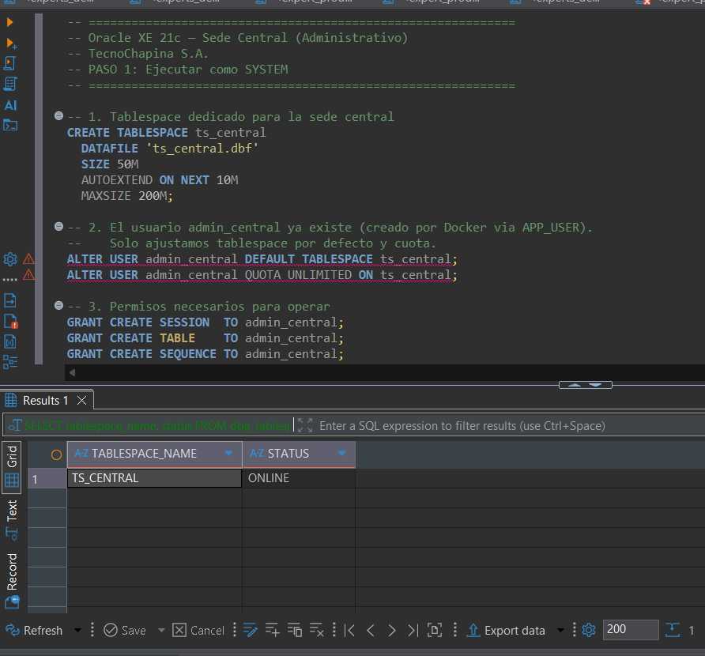

Las tres tablas (`empleados`, `proveedores`, `auditoria`) se crearon bajo el esquema de `admin_central` con `TABLESPACE ts_central`.

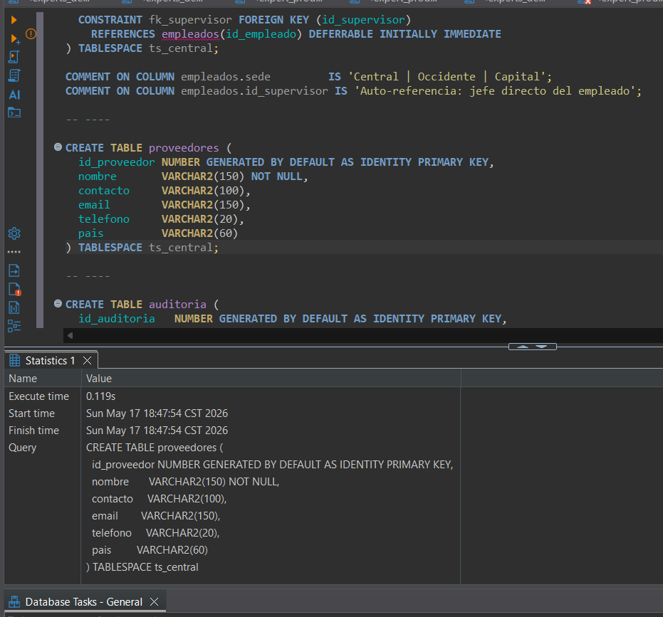

### 7.2 PostgreSQL — Esquema y rol

Se creó el esquema `inventario` para aislar las tablas del esquema `public` por defecto, y el rol `rol_inventario` con permisos de lectura y escritura sobre ese esquema.

```sql
CREATE SCHEMA IF NOT EXISTS inventario;
CREATE ROLE rol_inventario;
GRANT USAGE, CREATE ON SCHEMA inventario TO rol_inventario;
GRANT rol_inventario TO admin_inventario;
```

Las tres tablas (`categorias`, `productos`, `inventario`) se crearon bajo el esquema `inventario`.

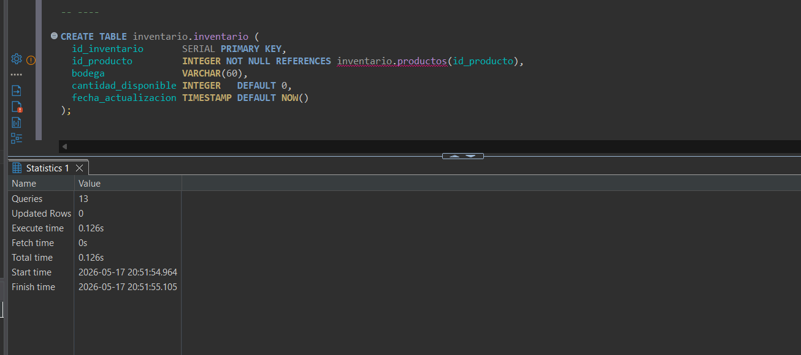

### 7.3 SQL Server — Base de datos, login y rol

Se creó la base de datos `ventas_db`, el login `usr_ventas` a nivel de servidor, y el rol `rol_ventas` con permisos DML sobre el esquema `dbo`.

```sql
CREATE DATABASE ventas_db;
CREATE LOGIN usr_ventas WITH PASSWORD = 'VentasPass123!';
CREATE USER  usr_ventas FOR LOGIN usr_ventas;
CREATE ROLE  rol_ventas;
GRANT SELECT, INSERT, UPDATE, DELETE ON SCHEMA::dbo TO rol_ventas;
ALTER ROLE rol_ventas ADD MEMBER usr_ventas;
```

Las tres tablas (`clientes`, `ventas`, `detalle_ventas`) se crearon en `ventas_db` con el campo `sucursal_id` en `ventas` como eje de la fragmentación horizontal.

### 7.4 Datos seed

Se insertaron datos realistas de una empresa guatemalteca de electrónica. La distribución final para la demo tiene 5 ventas por fragmento para facilitar la verificación visual:

| Motor | Tabla | Registros (demo) | Notas |
|---|---|---|---|
| Oracle | `empleados` | 10 | 3 Central, 4 Occidente, 3 Capital |
| Oracle | `proveedores` | 5 | — |
| Oracle | `auditoria` | 10 | — |
| Oracle | `ventas_backup` | 0 | Vacío en estado inicial; se llena con `POST /backup-oracle` |
| Oracle | `detalle_ventas_backup` | 0 | Ídem |
| PostgreSQL | `categorias` | 5 | — |
| PostgreSQL | `productos` | 15 | — |
| PostgreSQL | `inventario` | 15 | — |
| PostgreSQL | `ventas` | 5 | Fragmento Occidente (`sucursal_id = 2`) |
| PostgreSQL | `detalle_ventas` | 5–7 | Asociadas a ventas Occidente |
| SQL Server | `clientes` | 15 | Clientes de todas las sedes |
| SQL Server | `ventas` | 5 | Fragmento Capital (`sucursal_id = 1`) |
| SQL Server | `detalle_ventas` | 5–7 | Asociadas a ventas Capital |

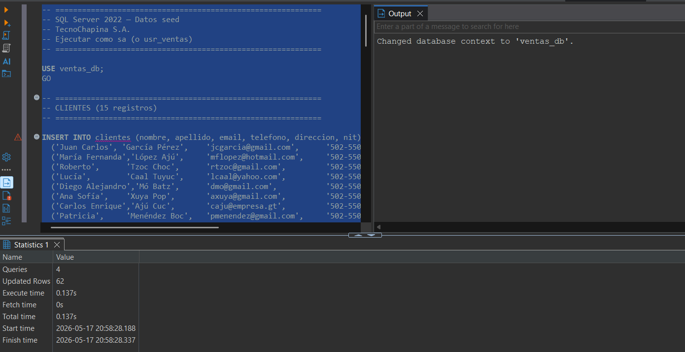

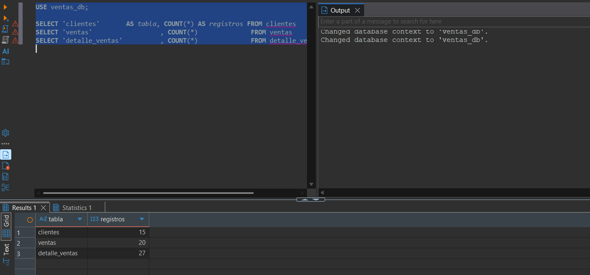

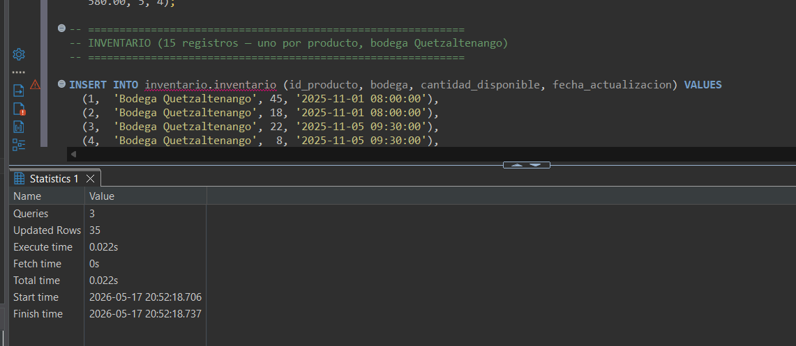

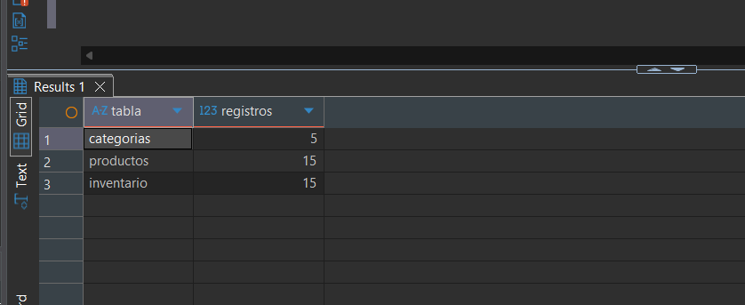

---

## 8. Día 4 — Fragmentación y replicación

### 8.1 Fragmentación horizontal física

La tabla `ventas` está **fragmentada físicamente** entre dos motores distintos. Cada motor contiene únicamente las filas que le corresponden y tiene una restricción (`CHECK`) que previene inserciones incorrectas.

| Fragmento | Motor | Constraint |
|-----------|-------|-----------|
| Capital | SQL Server — `dbo.ventas` | implícito (routing del backend) |
| Occidente | PostgreSQL — `inventario.ventas` | `CHECK (sucursal_id = 2)` |

**Scripts de fragmentación:**

- `sql/sqlserver/03_fragmentacion.sql` — crea la vista `ventas_capital` y elimina la vista `ventas_occidente` (ya no vive en SS)
- `sql/postgres/03_ventas.sql` — crea `inventario.ventas` e `inventario.detalle_ventas` con la restricción de Occidente

```sql
-- PostgreSQL: restricción física del fragmento
CREATE TABLE inventario.ventas (
    ...
    sucursal_id INTEGER NOT NULL CHECK (sucursal_id = 2),
    ...
);
```

**Routing en el backend:** el campo `sucursal_id` del body del `POST /ventas` determina el motor destino. No hay configuración adicional; el backend conoce la regla de routing.

**Verificación de los tres fragmentos en DBeaver:**

```sql
-- SQL Server
SELECT COUNT(*) FROM dbo.ventas WHERE sucursal_id = 1;          -- debe dar 5
SELECT COUNT(*) FROM dbo.ventas WHERE sucursal_id = 2;          -- debe dar 0

-- PostgreSQL
SELECT COUNT(*) FROM inventario.ventas WHERE sucursal_id = 2;   -- debe dar 5
SELECT COUNT(*) FROM inventario.ventas WHERE sucursal_id = 1;   -- debe dar 0

-- Oracle (backup — estado inicial vacío)
SELECT COUNT(*) FROM admin_central.ventas_backup;               -- debe dar 0
```

Scripts de verificación: `sql/sqlserver/04_verificar.sql`, `sql/postgres/05_verificar.sql`, `sql/oracle/05_verificar.sql`.


### 8.2 Por qué fragmentación horizontal física y no vistas lógicas

La fragmentación **física** (tablas en motores distintos) va más allá de las vistas `WHERE sucursal_id = X` sobre una tabla unificada:

- **Aislamiento real:** si SQL Server cae, PostgreSQL sigue operando con sus datos de Occidente sin ninguna dependencia.
- **Escalabilidad independiente:** cada motor puede dimensionarse según el volumen de su fragmento.
- **Demostración del failover:** con una tabla unificada no habría nada que rescatar; con fragmentación física, Oracle puede recibir el fragmento Capital mientras SQL Server "está caído".

### 8.3 Backup snapshot hacia Oracle (failover)

El endpoint `POST /backup-oracle` realiza una copia snapshot del fragmento Capital (SQL Server) hacia las tablas de backup en Oracle. La operación es **idempotente**: borra el contenido anterior antes de insertar.

```
POST /backup-oracle
  1. DELETE FROM admin_central.detalle_ventas_backup
  2. DELETE FROM admin_central.ventas_backup
  3. SELECT * FROM dbo.ventas        → INSERT INTO ventas_backup (usando ventas_backup_seq)
  4. SELECT * FROM dbo.detalle_ventas → INSERT INTO detalle_ventas_backup
  5. COMMIT
```

Para resetear el estado de Oracle a vacío (antes de una demo): ejecutar `sql/oracle/06_limpiar_backup.sql` en DBeaver.

**Dependencias del backend:**

```powershell
cd backend
pip install -r requirements.txt
copy .env.example .env
```

---

## 9. Día 5 — Consultas distribuidas

El backend FastAPI (`backend/main.py`) se conecta a los tres motores y orquesta las consultas en memoria Python. Cada endpoint devuelve un JSON con los datos y los motores que participaron.

### 9.1 Levantar el backend

```powershell
cd backend
uvicorn main:app --reload --port 8000
```

Documentación interactiva disponible en: `http://localhost:8000/docs`

### 9.2 Todos los endpoints

#### Consultas distribuidas

| Endpoint | Descripción | Motores activos | Failover-aware |
|---|---|---|---|
| `GET /q1` | Ventas por sucursal con nombre de producto | SS/Oracle* + PG | Sí |
| `GET /q2` | Inventario actual vs unidades vendidas | PG (inventario + ventas Occ) + SS/Oracle* (Capital) | Sí |
| `GET /q3` | Top productos más vendidos | SS/Oracle* + PG | Sí |
| `GET /q4` | Desempeño de empleados en ventas | SS/Oracle* + Oracle (empleados) | Sí |
| `GET /q5` | Reporte integrado — últimas 10 ventas | SS/Oracle* + PG + Oracle (empleados) | Sí |
| `GET /q6` | Vista unificada de TODAS las ventas con columna `motor` | SS/Oracle* + PG | Sí |

> \* En modo failover, SQL Server se reemplaza por Oracle backup (`ventas_backup`, `detalle_ventas_backup`).

#### Soporte operacional

| Endpoint | Método | Descripción |
|---|---|---|
| `GET /catalogos` | GET | Datos de referencia (clientes, empleados, productos, sucursales) |
| `POST /ventas` | POST | Insertar nueva venta — routing automático por `sucursal_id` |
| `GET /estado-sistema` | GET | Estado actual del failover y motores activos |
| `POST /backup-oracle` | POST | Copia snapshot de Capital (SS) → Oracle backup |
| `POST /simular-fallo` | POST | Activa failover: Capital redirige a Oracle |
| `POST /restaurar` | POST | Desactiva failover: vuelve a SQL Server |

### 9.3 Cómo funcionan las consultas distribuidas

Cada endpoint sigue el mismo patrón de tres pasos:

```
1. Consultar motor A  →  resultado_A (lista de filas)
2. Consultar motor B  →  resultado_B (diccionario indexado por PK)
3. Combinar en Python →  for fila in resultado_A: fila.update(resultado_B[fila.id])
```

No hay JOINs cross-motor. Los datos viajan por la red una vez por consulta y se ensamblan en memoria dentro del proceso Python. Esto es exactamente la **Opción B** de consultas distribuidas descrita en el plan del proyecto.

### 9.4 Descripción de cada consulta

**Q1 — Ventas por sucursal con nombre de producto**

Combina ventas de Capital (SS o Oracle backup) y Occidente (PG). PostgreSQL aporta el nombre del producto. El join se hace por `id_producto` en Python.

**Q2 — Inventario actual vs unidades vendidas**

PostgreSQL trae el stock disponible por producto y las unidades vendidas en Occidente. SS (o Oracle backup) aporta las unidades vendidas en Capital. El resultado muestra la diferencia para detectar productos en riesgo.

**Q3 — Top productos más vendidos**

Suma unidades vendidas en ambos fragmentos (Capital + Occidente). PostgreSQL agrega el nombre y la categoría. Útil para decisiones de reabastecimiento.

**Q4 — Desempeño de empleados en ventas**

Agrupa ventas de ambos fragmentos por `id_empleado`. Oracle aporta el nombre, puesto y sede de cada empleado. Muestra cuánto generó cada vendedor independientemente del motor donde esté el dato.

**Q5 — Reporte integrado (los 3 motores)**

Las 10 ventas más recientes de ambos fragmentos, con nombre de cliente (SS), nombre de producto (PG) y nombre del empleado (Oracle). Es la consulta que mejor demuestra la integración de los tres motores.

**Q6 — Vista unificada de todas las ventas**

Devuelve **todas** las ventas de Capital y Occidente en un solo resultado, con una columna `motor` que indica el origen de cada fila (`SQL Server` / `PostgreSQL` / `Oracle (failover)`). Permite ver el sistema completo de un vistazo y verificar que no hay solapamientos entre fragmentos.

### 9.5 Endpoints de soporte: catálogos, inserción y failover

**`GET /catalogos`**

Consulta los tres motores y devuelve los datos de referencia para el formulario de nueva venta.

**`POST /ventas`**

Routing automático por `sucursal_id`:

```json
// Body
{ "id_cliente": 3, "id_empleado": 2, "id_producto": 5, "cantidad": 2, "sucursal_id": 1 }

// Respuesta
{ "ok": true, "id_venta": 42, "sucursal": "Capital", "motor": "SQL Server", "total": 9599.96 }
```

- `sucursal_id = 2` → siempre PostgreSQL
- `sucursal_id = 1` + failover desactivado → SQL Server
- `sucursal_id = 1` + failover activo → Oracle (`ventas_backup`, usa `ventas_backup_seq.NEXTVAL`)

**`GET /estado-sistema`**

```json
{ "failover_activo": false, "capital": "SQL Server", "occidente": "PostgreSQL", "oracle_backup": "standby" }
```

**`POST /backup-oracle`** — copia snapshot Capital → Oracle (idempotente).

**`POST /simular-fallo`** — activa failover. Capital empieza a leer y escribir en Oracle.

**`POST /restaurar`** — desactiva failover. Capital vuelve a SQL Server.

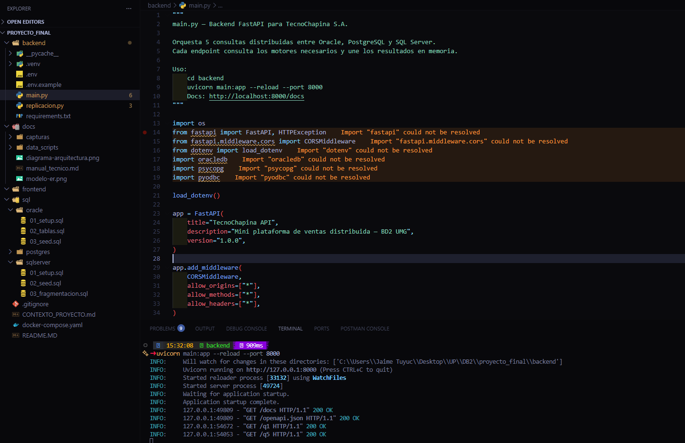

**Q1 — Ventas por sucursal con nombre de producto:**
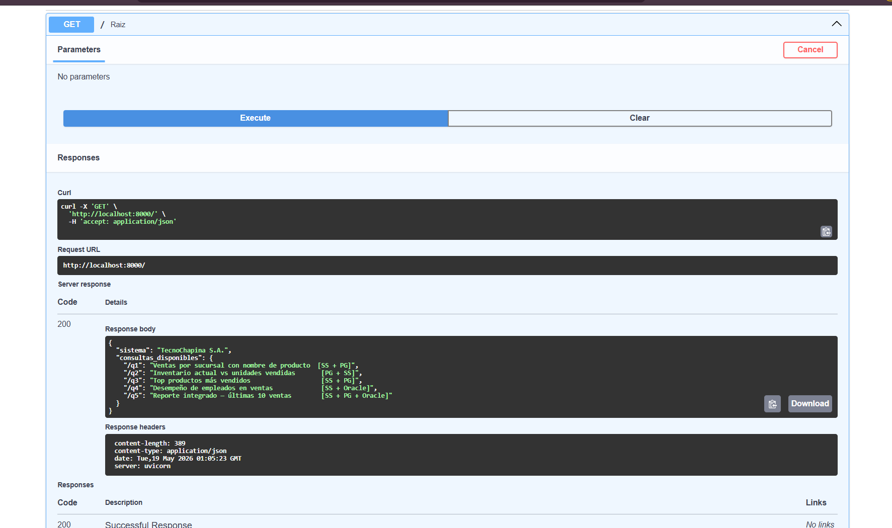

**Q2 — Inventario actual vs unidades vendidas:**
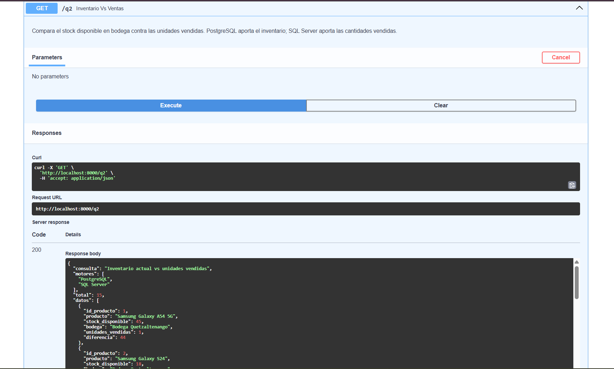

**Q3 — Top productos más vendidos:**
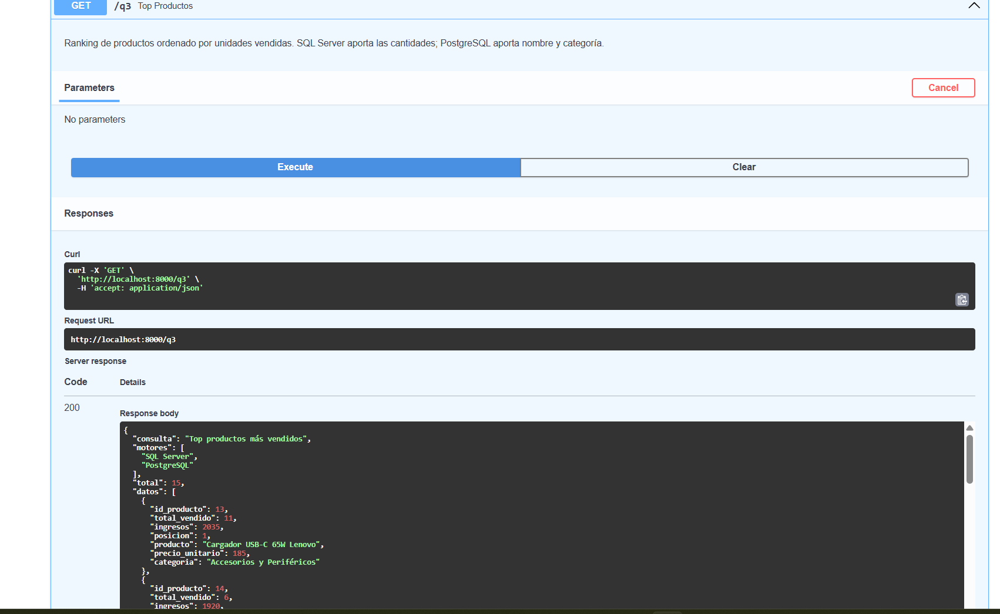

**Q4 — Desempeño de empleados en ventas:**
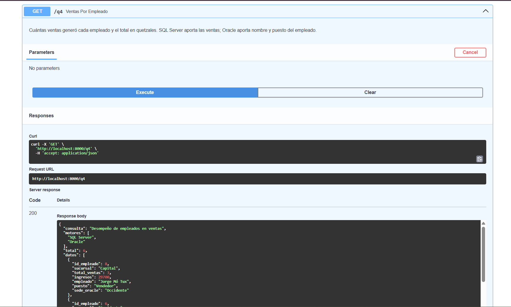

**Q5 — Reporte integrado (los 3 motores):**
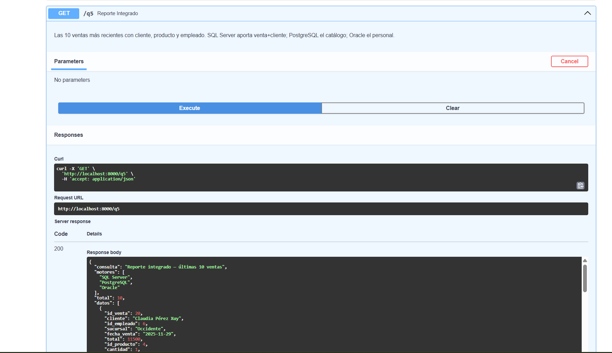

---

## 10. Día 6 — Interfaz de usuario

La interfaz se construyó con **Next.js 15** (App Router) y **Tailwind CSS 4**. Tiene **tres tabs** accesibles desde un tab bar: consultas distribuidas, inserción de ventas y panel de sistema/failover.

Cuando el failover está activo, un **banner naranja** aparece en la parte superior de todas las tabs indicando que Capital está operando sobre Oracle backup.

### 10.1 Levantar el frontend

```powershell
cd frontend
pnpm dev
```

Abrir: `http://localhost:3000`

> El backend debe estar corriendo en `http://localhost:8000` antes de usar la UI.

### 10.2 Tab — Consultas distribuidas

| Elemento | Descripción |
|---|---|
| Dropdown | Selecciona la consulta a ejecutar (Q1–Q6) |
| Badges de motores | Muestra qué motores participan en cada consulta (color por motor) |
| Badge FAILOVER | Aparece en naranja cuando una consulta está leyendo desde Oracle backup |
| Botón Ejecutar | Llama al endpoint FastAPI y muestra los resultados |
| Tabla dinámica | Genera columnas automáticamente a partir de las claves del JSON |
| Columna `motor` (Q6) | Indica el motor origen de cada fila de la vista unificada |

### 10.3 Tab — Nueva venta (fragmentación dinámica)

Permite insertar una nueva venta y **demuestra el routing real entre motores**:

| Campo | Fuente de datos | Motor |
|---|---|---|
| Sucursal | Estático (Capital / Occidente) | — |
| Cliente | `GET /catalogos` | SQL Server |
| Empleado | `GET /catalogos` | Oracle |
| Producto | `GET /catalogos` | PostgreSQL |
| Cantidad | Número libre (mínimo 1) | — |

La UI muestra el motor activo al que irá la venta (según el estado de failover). Con failover activo, Capital aparece como "Oracle (backup)".

**Flujo completo:**

```
1. Abrir tab "Nueva venta"
2. Los dropdowns se cargan automáticamente desde /catalogos
3. Seleccionar sucursal, cliente, empleado, producto y cantidad
4. Click "Registrar venta"
5. La UI muestra motor destino, id_venta generado y total
6. Click "Ver en Q6 →" para verificar el registro en la vista unificada
```

### 10.4 Tab — Sistema / Failover

Panel de control para demostrar la tolerancia a fallos en tiempo real:

| Elemento | Descripción |
|---|---|
| Tabla de motores | Estado actual de cada motor (activo / backup / standby) |
| Botón "Crear backup en Oracle" | Ejecuta `POST /backup-oracle` — copia snapshot de Capital |
| Botón "Simular fallo SS" | Activa failover — todas las consultas y escrituras de Capital van a Oracle |
| Botón "Restaurar SS" | Desactiva failover — vuelve a SQL Server |
| Atajos de demo rápida | Botones Q1, Q4, Q5, Q6 para verificar el estado del sistema al instante |

**Flujo de demo en la defensa:**

```
1. Abrir tab Sistema → mostrar estado normal (SS activo)
2. Ejecutar "Crear backup en Oracle" → Oracle pasa de 0 a N registros
3. Ejecutar "Simular fallo SS" → banner naranja aparece en todas las tabs
4. Insertar nueva venta Capital → va a Oracle (el ID empieza en 10001+)
5. Ejecutar Q6 → columna motor muestra "Oracle (failover)" para Capital
6. Ejecutar "Restaurar SS" → sistema vuelve a normal, banner desaparece
```

### 10.5 Estructura del frontend

```
frontend/
├── app/
│   ├── layout.tsx        # Título "TecnoChapina S.A. — BD2"
│   ├── page.tsx          # Toda la lógica: 3 tabs, consultas, formulario, failover
│   └── globals.css       # Tailwind 4 con @import "tailwindcss"
├── .env.local            # NEXT_PUBLIC_API_URL=http://localhost:8000
└── package.json          # Next.js 15, React 19, Tailwind 4 (pnpm)
```

### 10.6 Capturas de la interfaz


---

## 11. Ventajas, desventajas y problemas encontrados

### 11.1 Ventajas observadas

**Fragmentación física real:**
Los datos de Capital y Occidente viven en motores distintos. Si SQL Server cae, PostgreSQL sigue operando con todos sus datos de Occidente sin ninguna dependencia. El failover a Oracle demuestra que la arquitectura puede sobrevivir la pérdida de un nodo.

**Especialización por motor:**
Oracle maneja administración con tablespaces y auditoría. PostgreSQL gestiona inventario y el fragmento Occidente. SQL Server procesa el fragmento Capital. Cada motor hace lo que mejor sabe hacer.

**Failover transparente para la UI:**
El cambio de motor ocurre completamente en el backend. La interfaz de usuario no sabe qué motor está respondiendo; solo ve los datos correctos. Esto simula un escenario real de alta disponibilidad.

**Routing automático por sucursal:**
El campo `sucursal_id` determina el motor destino sin intervención del usuario. Un nuevo vendedor de Capital y uno de Occidente insertan ventas con el mismo formulario; el backend decide dónde va cada una.

**Portabilidad del entorno:**
Docker Compose levanta los tres motores con un solo comando. Cualquier persona puede reproducir el entorno exacto sin instalar Oracle, PostgreSQL ni SQL Server de forma nativa.

---

### 11.2 Desventajas y limitaciones

**Sin transacciones ACID cross-motor:**
Si una venta se registra en SQL Server pero falla la actualización de inventario en PostgreSQL, no hay rollback automático. Esto requeriría 2PC (Two-Phase Commit), fuera del alcance del proyecto.

**Backup manual (snapshot):**
El backup hacia Oracle es manual (hay que ejecutar `POST /backup-oracle`). En producción se usaría replicación continua o streaming. El snapshot puede perder las ventas insertadas entre el último backup y el momento del fallo.

**Latencia adicional:**
Una consulta distribuida abre 2 o 3 conexiones TCP y ensambla resultados en Python. Con ~50 registros funciona bien; con millones de filas y sin índices adecuados sería un cuello de botella.

**Restauración manual:**
Al restaurar, el sistema vuelve a SQL Server pero el backup en Oracle contiene las ventas insertadas durante el failover. Sincronizar de vuelta requeriría una migración inversa, que no está implementada en este prototipo.

---

### 11.3 Problemas técnicos encontrados y cómo se resolvieron

| # | Problema | Causa | Solución |
|---|---|---|---|
| 1 | `psycopg-binary==3.2.0.dev1 not found` | El extra `[binary]` resolvía a una pre-release inexistente en PyPI | Fijar la versión a `psycopg[binary]==3.2.13` |
| 2 | `pyodbc.InterfaceError IM002` | El script usaba ODBC Driver 18, pero la máquina solo tiene Driver 17 | Verificar con `Get-OdbcDriver` en PowerShell y cambiar el string a `ODBC Driver 17 for SQL Server` |
| 3 | Oracle rechazaba la columna `cargo` | La columna real en `empleados` se llama `puesto`, no `cargo` | Leer `sql/oracle/02_tablas.sql` antes de escribir las queries del backend |
| 4 | Oracle tardaba en arrancar | Primera inicialización de XE tarda 1-3 minutos | Esperar el mensaje `DATABASE IS READY TO USE!` en los logs antes de conectar |
| 5 | SQL Server rechaza conexión sin `TrustServerCertificate` | Docker usa certificado SSL autofirmado | Agregar `TrustServerCertificate=yes` en el connection string de pyodbc |
| 6 | `ORA-00955` al crear tablas de backup | Las tablas ya existían de una ejecución anterior | Usar `BEGIN EXECUTE IMMEDIATE 'DROP TABLE...'; EXCEPTION WHEN OTHERS THEN NULL; END;` antes de los CREATE |
| 7 | `ORA-00900` al ejecutar PL/SQL en DBeaver | El delimitador `/` de SQL*Plus no funciona en DBeaver | Agrupar todos los DROP en un único bloque `BEGIN...END;` sin delimitadores; los CREATE van como sentencias independientes |
| 8 | Ventas de Occidente seguían en SS tras la migración | La migración no las eliminaba | `backend/migracion_ventas.py` lee de SS, inserta en PG con `OVERRIDING SYSTEM VALUE` para preservar IDs, luego elimina de SS |

---

## 12. Conclusiones y aprendizajes

### 12.1 Sobre las bases de datos distribuidas

Las bases de datos distribuidas no son una solución universal. Son la respuesta correcta cuando los datos tienen **propietarios distintos** (una sucursal no debería tener acceso total a los datos de otra), cuando los **volúmenes por dominio** justifican motores especializados, o cuando la **disponibilidad parcial** es preferible a la falla total del sistema.

En este proyecto, la distribución y el failover tienen sentido porque:
- El inventario (Occidente) y las ventas (Capital) son operaciones independientes.
- Los datos administrativos (Oracle/Central) deben estar centralizados y auditados.
- La caída de un nodo no puede detener la operación de los demás.

### 12.2 Sobre la fragmentación física vs lógica

La diferencia entre una vista (`WHERE sucursal_id = 1`) y una tabla física en otro motor no es trivial:

- **Vista lógica:** los datos siguen en un motor; si ese motor falla, todo falla.
- **Tabla física en otro motor:** cada nodo es autónomo. Si SQL Server cae, PostgreSQL tiene sus propios datos intactos y Oracle puede absorber el fragmento Capital temporalmente.

Este proyecto implementa fragmentación **física real**, que es lo que se encontraría en una arquitectura empresarial de mediana escala.

### 12.3 Sobre el failover y la consistencia eventual

El backup snapshot hacia Oracle demuestra un patrón real de alta disponibilidad: un nodo secundario listo para absorber carga si el primario falla. Las limitaciones de esta implementación (backup manual, sin sincronización de vuelta) son exactamente las mismas que tiene cualquier sistema con replicación asíncrona: puede haber pérdida de datos entre el último backup y el momento del fallo.

Resolver esto completamente requeriría replicación continua (WAL streaming en PostgreSQL, Always On en SQL Server) — conceptos que quedan fuera del alcance pedagógico pero que se comprenden mejor después de implementar este prototipo.

### 12.4 Sobre la integración sin linked servers

Python como capa de orquestación (en lugar de Database Links u Oracle Linked Servers) ofrece:
- **Sin configuración de red compleja:** los motores no necesitan verse entre sí.
- **Portabilidad:** el mismo código corre en Windows, Linux y Mac.
- **Control total del join y del routing:** cualquier lógica de negocio puede aplicarse antes de devolver el resultado.

La desventaja es que el join ocurre en memoria Python y no aprovecha los índices de los motores remotos. Para datasets grandes sería necesario empujar más lógica al motor.

### 12.5 Aprendizajes clave

1. **Leer el esquema antes de escribir queries.** El error de `cargo` vs `puesto` se habría evitado revisando el DDL antes de asumir nombres de columnas.
2. **Verificar el entorno antes de codificar.** El driver ODBC disponible determina qué string usar; no asumir que está la versión más reciente.
3. **Los dialectos SQL difieren en detalles críticos.** `BEGIN...END;` con DBeaver vs SQL*Plus, `OVERRIDING SYSTEM VALUE` en PostgreSQL, `SELECT TOP N` vs `FETCH FIRST N ROWS ONLY` — son diferencias pequeñas con consecuencias grandes.
4. **Docker simplifica la distribución del entorno**, pero no elimina la complejidad de los motores. Cada motor tiene sus propias reglas de autenticación, tipos de datos y permisos.
5. **La complejidad real de los sistemas distribuidos** está en la consistencia y el manejo de fallos, no en levantar los contenedores. Este proyecto implementa un failover real (no simulado en código) y eso hace la diferencia para entender por qué los sistemas distribuidos son difíciles de mantener correctos.

---

## Anexo A — Cómo regenerar el entorno desde cero

```powershell
# 1. Clonar el repositorio
git clone <url-del-repo>
cd proyecto_final

# 2. Levantar la infraestructura
docker compose up -d

# 3. Esperar a que los healthchecks pasen (Oracle tarda ~2 min)
docker compose ps
```

**Orden de ejecución de scripts SQL en DBeaver:**

| Motor | Scripts (en orden) |
|-------|-------------------|
| Oracle | `01_setup.sql` → `02_tablas.sql` → `03_seed.sql` → `04_backup.sql` → `05_verificar.sql` |
| PostgreSQL | `01_setup.sql` → `02_seed.sql` → `03_ventas.sql` → `04_seed_ventas.sql` → `05_verificar.sql` |
| SQL Server | `01_login_db.sql` → `02_seed.sql` → `03_fragmentacion.sql` → `04_verificar.sql` |

**Para la demo (dejar solo 5 ventas por motor):**

```
SQL Server → ejecutar sql/sqlserver/05_reducir_datos.sql
PostgreSQL → ejecutar sql/postgres/06_reducir_datos.sql
Oracle     → ejecutar sql/oracle/06_limpiar_backup.sql   (backup ya vacío)
```

**Levantar el backend y frontend:**

```powershell
# Backend (en una terminal)
cd backend
pip install -r requirements.txt
uvicorn main:app --reload --port 8000

# Frontend (en otra terminal)
cd frontend
pnpm install
pnpm dev
```
