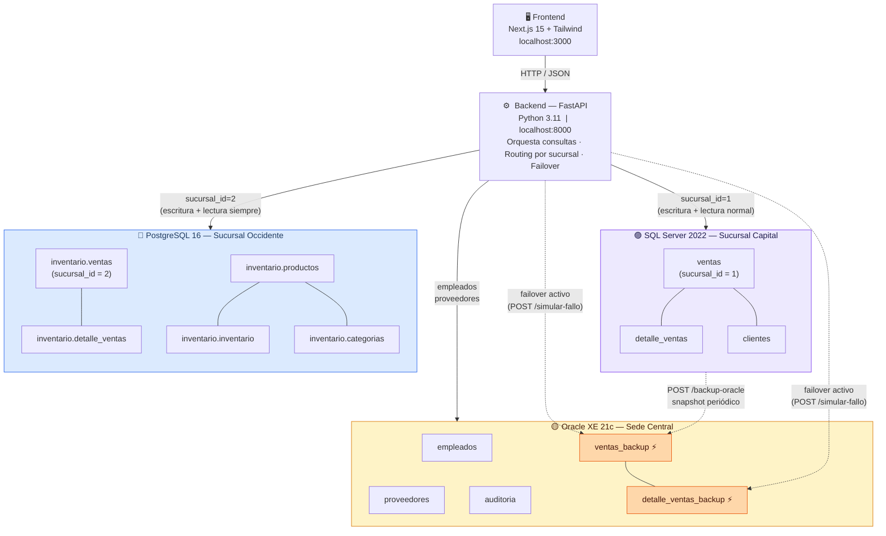
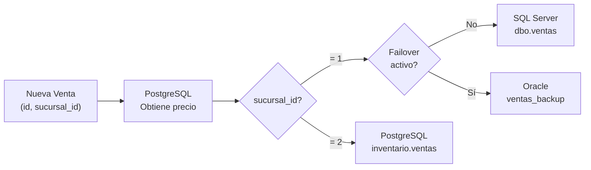
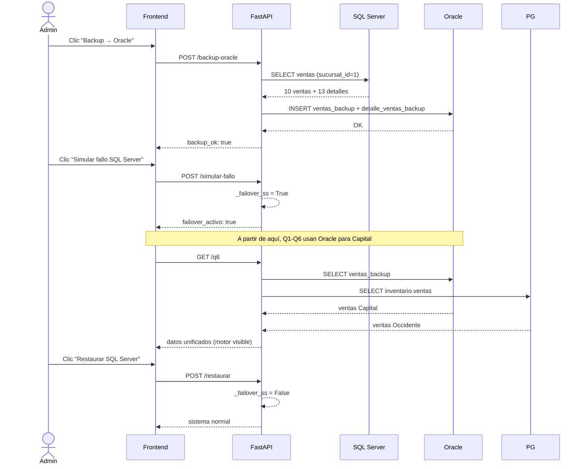

# Arquitectura del Sistema — TecnoChapina S.A. (v2)

Actualización que implementa **fragmentación horizontal física real** y **failover transparente**.

---

## Diagrama de arquitectura

---

## Routing de escritura (POST /ventas)

---

## Flujo de failover

---

## Distribución de tablas por motor

| Motor | Puerto | Tablas | Rol en fragmentación |
|---|---|---|---|
| SQL Server 2022 | 1433 | `ventas` (id=1), `detalle_ventas`, `clientes` | Fragmento Capital + catálogo de clientes |
| PostgreSQL 16 | 5432 | `ventas` (id=2), `detalle_ventas`, `productos`, `inventario`, `categorias` | Fragmento Occidente + catálogo de productos |
| Oracle XE 21c | 1521 | `empleados`, `proveedores`, `auditoria`, `ventas_backup`, `detalle_ventas_backup` | Admin central + backup para failover |

---

## Consultas distribuidas — motores involucrados

| Endpoint | Motor A | Motor B | Motor C | Failover A |
|---|---|---|---|---|
| GET /q1 | SQL Server | PostgreSQL | — | Oracle backup |
| GET /q2 | PostgreSQL | SQL Server | — | Oracle backup |
| GET /q3 | SQL Server | PostgreSQL | — | Oracle backup |
| GET /q4 | SQL Server | PostgreSQL | Oracle | Oracle backup |
| GET /q5 | SQL Server | PostgreSQL | Oracle | Oracle backup |
| GET /q6 | SQL Server | PostgreSQL | Oracle (empleados) | Oracle backup |
| POST /ventas | SS o PG | PostgreSQL (precio) | Oracle (failover) | Oracle backup |
| POST /backup-oracle | SQL Server (lectura) | — | Oracle (escritura) | — |

---

## Diferencia con la versión anterior (v1)

| Aspecto | v1 | v2 |
|---|---|---|
| Fragmentación | Lógica (vistas en SS) | **Física** (tablas en motores distintos) |
| ventas Occidente | Vista filtrada en SQL Server | Tabla real en PostgreSQL |
| POST /ventas | Siempre a SQL Server | Routing por `sucursal_id` |
| Tolerancia a fallos | Ninguna | Failover SS → Oracle (backup) |
| Consulta Q6 | No existía | Vista unificada con columna `motor` |
