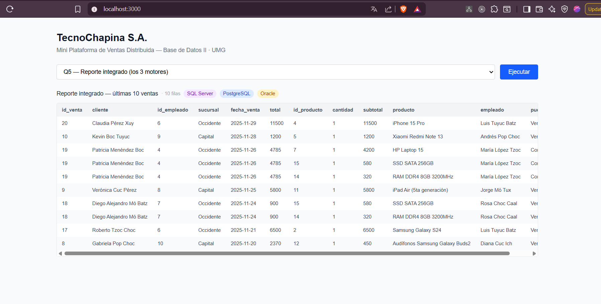

# Manual Técnico — TecnoChapina S.A.
## Mini Plataforma Empresarial de Ventas Distribuida

**Curso:** Base de Datos II — Universidad Mariano Gálvez de Guatemala  
**Catedrático:** Ing. Angel Atilio Maltez C.  
**Estudiante:** Jaime Israel Tuyuc Tzaj — Carné 1990-18-2320  
**Fecha de entrega:** 2 de junio de 2026

---

## Propósito de este documento

Este manual documenta paso a paso cómo fue construida la plataforma, qué decisiones se tomaron y por qué, y cómo replicar el entorno desde cero. Sirve también como guía de estudio para la defensa oral.

---

## Índice

1. [Prerequisitos](#1-prerequisitos)
2. [Infraestructura Docker](#2-infraestructura-docker)
3. [Verificación de contenedores](#3-verificación-de-contenedores)
4. [Conexión desde DBeaver](#4-conexión-desde-dbeaver)
5. [Esquemas, usuarios y permisos](#5-esquemas-usuarios-y-permisos)
6. [Datos seed](#6-datos-seed)
7. [Fragmentación horizontal](#7-fragmentación-horizontal)
8. [Replicación básica](#8-replicación-básica)
9. [Consultas distribuidas](#9-consultas-distribuidas)
10. [Backend FastAPI](#10-backend-fastapi)
11. [Frontend Next.js](#11-frontend-nextjs)
12. [Errores encontrados y soluciones](#12-errores-encontrados-y-soluciones)

---

## 1. Prerequisitos

### Software requerido

| Herramienta | Versión mínima | Descarga |
|---|---|---|
| Docker Desktop | 4.x | docker.com/products/docker-desktop |
| DBeaver Community | 24.x | dbeaver.io |
| Python | 3.11+ | python.org |
| Node.js | 20 LTS | nodejs.org |

### Verificar instalaciones

```powershell
docker --version
docker compose version
python --version
node --version
```

---

## 2. Infraestructura Docker

### 2.1 Estructura del proyecto

```
proyecto_final/
├── docker-compose.yaml          # Define los 3 contenedores
├── .gitignore
├── README.MD                    # Documento principal del proyecto
├── CONTEXTO_PROYECTO.md         # Decisiones de diseño y estado
├── docs/
│   ├── manual_tecnico.md        # Este archivo
│   ├── capturas/                # Screenshots para el README
│   ├── diagrama-arquitectura.png
│   └── modelo-er.png
├── sql/
│   ├── oracle/                  # Scripts .sql ejecutados al primer arranque
│   ├── postgres/                # Scripts .sql ejecutados al primer arranque
│   └── sqlserver/               # Scripts ejecutados manualmente
├── backend/                     # FastAPI (Python)
└── frontend/                    # Next.js 15
```

### 2.2 El archivo docker-compose.yaml

Se levantan tres servicios independientes conectados por la red interna `bdd-net`:

```
bdd-net (red bridge interna)
├── bdd_oracle     → puerto 1521 (Oracle XE 21c)
├── bdd_postgres   → puerto 5432 (PostgreSQL 16 Alpine)
└── bdd_sqlserver  → puerto 1433 (SQL Server 2022 Developer)
```

**Por qué cada imagen:**

- **Oracle:** `gvenzl/oracle-xe:21-slim-faststart` — NO se usa la imagen oficial de Oracle porque requiere registro en Oracle Container Registry. Esta imagen es mantenida por un PM de Oracle, arranca en ~2 minutos y no requiere cuenta.
- **PostgreSQL:** `postgres:16-alpine` — Alpine reduce el tamaño de la imagen a ~80 MB.
- **SQL Server:** `mcr.microsoft.com/mssql/server:2022-latest` edición Developer — gratuita para entornos no productivos. La contraseña debe cumplir los requisitos de complejidad de Microsoft (mayúscula, número, símbolo).

**Por qué healthchecks:** cada contenedor incluye un healthcheck para saber cuándo el motor está listo para aceptar conexiones (no solo cuándo el proceso arrancó). Oracle puede tardar hasta 2 minutos en estar listo aunque el contenedor ya esté "running".

### 2.3 Levantar el entorno

```powershell
# Desde la carpeta raíz del proyecto
docker compose up -d

# Ver el estado (esperar a que todos digan "healthy")
docker compose ps
```

La salida esperada cuando todo está listo:

```
NAME            IMAGE                                    STATUS
bdd_oracle      gvenzl/oracle-xe:21-slim-faststart      Up (healthy)
bdd_postgres    postgres:16-alpine                       Up (healthy)
bdd_sqlserver   mcr.microsoft.com/mssql/server:2022-... Up (healthy)
```

> Oracle puede tardar entre 1 y 3 minutos en pasar de "starting" a "healthy". Es normal.

### 2.4 Detener sin borrar datos

```powershell
docker compose down
```

### 2.5 Eliminar TODO (incluyendo datos)

```powershell
# CUIDADO: esto borra los volúmenes y todos los datos
docker compose down -v
```

---

## 3. Verificación de contenedores

### 3.1 Oracle

```powershell
docker exec -it bdd_oracle sqlplus system/OraclePass123@//localhost:1521/XEPDB1
```

Dentro de SQL*Plus verificar:
```sql
SELECT name, open_mode FROM v$pdbs;
-- Debe mostrar XEPDB1 con READ WRITE
EXIT;
```

### 3.2 PostgreSQL

```powershell
docker exec -it bdd_postgres psql -U admin_inventario -d inventario_db
```

Dentro de psql:
```sql
SELECT version();
\q
```

### 3.3 SQL Server

```powershell
docker exec -it bdd_sqlserver /opt/mssql-tools18/bin/sqlcmd `
  -S localhost -U sa -P "SqlServerPass123!" -C `
  -Q "SELECT @@VERSION"
```

---

## 4. Conexión desde DBeaver

DBeaver permite administrar los tres motores desde una sola herramienta, lo que facilita comparar datos entre motores durante la demostración.

### 4.1 Configuración Oracle

| Campo | Valor |
|---|---|
| Connection type | Service Name |
| Host | localhost |
| Port | 1521 |
| Service Name | XEPDB1 |
| Username | system |
| Password | OraclePass123 |

> Si DBeaver pide descargar el driver JDBC de Oracle, aceptar — lo descarga automáticamente.

### 4.2 Configuración PostgreSQL

| Campo | Valor |
|---|---|
| Host | localhost |
| Port | 5432 |
| Database | inventario_db |
| Username | admin_inventario |
| Password | PostgresPass123 |

### 4.3 Configuración SQL Server

| Campo | Valor |
|---|---|
| Host | localhost |
| Port | 1433 |
| Database | master |
| Username | sa |
| Password | SqlServerPass123! |

> **Importante:** en la pestaña *Driver properties* de DBeaver para SQL Server, agregar la propiedad `trustServerCertificate = true`. Sin esto, la conexión falla por certificado SSL autofirmado.

---

## 4b. Diagramas y modelo ER (Día 2)

### Herramientas utilizadas

- **dbdiagram.io** — para el modelo ER. Se escribe el esquema en DBML (Database Markup Language) y el sitio genera el diagrama visual automáticamente.
- **Excalidraw** — para el diagrama de arquitectura. Herramienta de diagramación libre con estilo de boceto.

### Cómo regenerar el modelo ER

1. Ir a [dbdiagram.io](https://dbdiagram.io)
2. Borrar el contenido de ejemplo
3. Pegar el código DBML que está documentado en el README (sección 4)
4. Exportar como PNG → guardar en `docs/modelo-er.png`

### Decisiones del modelo ER

**FK reales vs. referencias lógicas:**

Las FK reales solo existen dentro del mismo motor porque los motores de base de datos no pueden enforcar integridad referencial entre instancias distintas. Las referencias cross-motor (por ejemplo, `detalle_ventas.id_producto` apuntando a PostgreSQL) son "contratos" que respeta el código Python, no restricciones del motor.

**Por qué `auditoria` no tiene FK:**

La tabla `auditoria` usa `tabla_afectada VARCHAR` + `id_registro INTEGER` para poder registrar operaciones de cualquier tabla sin estar atada a una sola. Una FK la haría demasiado específica.

**Campo `sucursal_id` en `ventas`:**

Este campo es el eje de la fragmentación horizontal. El valor `1` corresponde a Sucursal Capital y `2` a Sucursal Occidente. En un sistema real, cada valor viviría en un servidor físico diferente.

---

## 5. Esquemas, usuarios y permisos (Día 3)

### 5.1 Oracle — Tablespace, usuario y permisos

**Orden de ejecución en DBeaver:**

1. Abrir SQL editor desde la conexión **SYSTEM**
2. Ejecutar `sql/oracle/01_setup.sql` con **Alt+X**
3. Abrir SQL editor desde la conexión **admin_central**
4. Ejecutar `sql/oracle/02_tablas.sql` con **Alt+X**

**Por qué dos conexiones distintas:** el tablespace y los GRANTs los crea SYSTEM (tiene privilegios de DBA). Las tablas las crea admin_central para que queden en su esquema. Si se crean como SYSTEM, quedan en el esquema equivocado y las consultas sin prefijo fallan.

**Verificar tablespace creado (como SYSTEM):**
```sql
SELECT tablespace_name, status, block_size
FROM dba_tablespaces
WHERE tablespace_name = 'TS_CENTRAL';
```

**Verificar tablas creadas (como admin_central):**
```sql
SELECT table_name, tablespace_name FROM user_tables ORDER BY table_name;
```

**Agregar conexión admin_central en DBeaver:**

| Campo | Valor |
|---|---|
| Connection type | Service Name |
| Host | localhost |
| Port | 1521 |
| Service Name | XEPDB1 |
| Username | admin_central |
| Password | AdminPass123 |

### 5.2 PostgreSQL — Esquema y rol

**Ejecutar desde la conexión admin_inventario con Alt+X:**

```
sql/postgres/01_setup.sql
```

El script crea el esquema `inventario`, el rol `rol_inventario` y lo asigna a `admin_inventario`. También crea las 3 tablas bajo `inventario.*`.

**Verificar:**
```sql
SELECT schema_name FROM information_schema.schemata WHERE schema_name = 'inventario';
SELECT table_name FROM information_schema.tables WHERE table_schema = 'inventario';
```

### 5.3 SQL Server — Base de datos, login y rol

**Ejecutar desde la conexión sa con Alt+X:**

```
sql/sqlserver/01_setup.sql
```

El script crea `ventas_db`, el login `usr_ventas`, el rol `rol_ventas` y las 3 tablas. Los `GO` separan los lotes de ejecución (batch separators de T-SQL).

**Verificar:**
```sql
USE ventas_db;
SELECT name FROM sys.tables ORDER BY name;
SELECT name FROM sys.database_principals WHERE type = 'R' AND name = 'rol_ventas';
```

---

## 6. Datos seed (Día 3)

Volumen total: 9 tablas, ~125 registros distribuidos entre los tres motores.

**Orden de ejecución:**

| Script | Conexión | Registros |
|---|---|---|
| `sql/oracle/03_seed.sql` | admin_central | 10 empleados + 5 proveedores + 10 auditorías |
| `sql/postgres/02_seed.sql` | admin_inventario | 5 categorías + 15 productos + 15 inventarios |
| `sql/sqlserver/02_seed.sql` | sa | 15 clientes + 20 ventas + 35 detalles |

**Para Oracle: usar Alt+X, NO Ctrl+Enter.** Ctrl+Enter ejecuta solo la sentencia bajo el cursor. Alt+X ejecuta el script completo sentencia por sentencia.

**Verificación rápida en cada motor:**

```sql
-- Oracle (admin_central)
SELECT 'empleados' AS tabla, COUNT(*) AS n FROM empleados   UNION ALL
SELECT 'proveedores',        COUNT(*)        FROM proveedores UNION ALL
SELECT 'auditoria',          COUNT(*)        FROM auditoria;
-- Esperado: 10, 5, 10

-- PostgreSQL (admin_inventario)
SELECT 'categorias' AS tabla, COUNT(*) AS n FROM inventario.categorias UNION ALL
SELECT 'productos',           COUNT(*)        FROM inventario.productos  UNION ALL
SELECT 'inventario',          COUNT(*)        FROM inventario.inventario;
-- Esperado: 5, 15, 15

-- SQL Server (sa, USE ventas_db)
SELECT 'clientes'       AS tabla, COUNT(*) AS n FROM clientes       UNION ALL
SELECT 'ventas',                  COUNT(*)        FROM ventas         UNION ALL
SELECT 'detalle_ventas',          COUNT(*)        FROM detalle_ventas;
-- Esperado: 15, 20, 35
```

---

## 7. Fragmentación horizontal (Día 4)

### 7.1 Concepto

La fragmentación horizontal divide una tabla en subconjuntos de **filas** según un criterio. Cada subconjunto (fragmento) puede residir en un nodo diferente. La unión de todos los fragmentos reconstruye la tabla completa.

**Criterio usado:** campo `sucursal_id` en la tabla `ventas` de SQL Server.

| `sucursal_id` | Fragmento | Nodo (simulado) |
|---|---|---|
| 1 | Sucursal Capital | Zona 10, Guatemala |
| 2 | Sucursal Occidente | Quetzaltenango |

### 7.2 Implementación con vistas

Se crean dos vistas en SQL Server que actúan como los "fragmentos lógicos". En un sistema distribuido real, cada vista apuntaría a una tabla en un servidor distinto. Aquí lo simulamos con filtros.

**Ejecutar `sql/sqlserver/03_fragmentacion.sql` como `sa` en `ventas_db`:**

```sql
-- Vista fragmento Capital
CREATE OR ALTER VIEW dbo.ventas_capital AS
SELECT * FROM dbo.ventas WHERE sucursal_id = 1;

-- Vista fragmento Occidente
CREATE OR ALTER VIEW dbo.ventas_occidente AS
SELECT * FROM dbo.ventas WHERE sucursal_id = 2;
```

### 7.3 Verificación

```sql
USE ventas_db;

-- Resumen por fragmento
SELECT
    'Capital'  AS sucursal, COUNT(*) AS ventas, SUM(total) AS total_Q
FROM dbo.ventas WHERE sucursal_id = 1
UNION ALL
SELECT
    'Occidente', COUNT(*), SUM(total)
FROM dbo.ventas WHERE sucursal_id = 2;
-- Esperado: 10 ventas en cada fragmento

-- Consultar los fragmentos como tablas independientes
SELECT * FROM dbo.ventas_capital;
SELECT * FROM dbo.ventas_occidente;
```

### 7.4 Por qué este tipo de fragmentación

- **Horizontal vs. vertical:** se eligió horizontal porque el criterio de distribución es geográfico (por sucursal, no por columnas).
- **Ventaja:** una consulta de ventas de una sucursal específica solo necesita escanear su fragmento, no la tabla completa.
- **Limitación:** en este proyecto el dato físico sigue estando en una sola tabla (SQL Server). El sistema real requeriría servidores distintos o particiones físicas de tabla.

---

## 8. Replicación básica (Día 4)

### 8.1 Concepto

La replicación copia datos de un nodo origen a un nodo destino para que estén disponibles localmente. El objetivo en este proyecto es que SQL Server tenga el catálogo de productos de PostgreSQL sin necesidad de cruzar la red en cada consulta de ventas.

**Origen:** `inventario.productos` (PostgreSQL — Sucursal Occidente)
**Destino:** `productos_replica` (SQL Server — Sucursal Capital)

### 8.2 Tipo de replicación

**Snapshot manual:** el script trunca la tabla destino y reinserta todos los registros del origen en cada ejecución. No es incremental. Se eligió este enfoque porque:

- El catálogo de productos (~15 registros) es pequeño — no hay beneficio de hacer delta.
- Es más simple de implementar, auditar y explicar en la defensa.
- Cumple el objetivo pedagógico: demostrar que datos de un motor aparecen en otro.

### 8.3 Estructura del backend

```
backend/
├── requirements.txt      # Dependencias Python
├── .env.example          # Plantilla de variables de entorno
├── .env                  # Credenciales reales (NO subir a Git)
└── replicacion.py        # Script de replicación snapshot
```

### 8.4 Instalación

```powershell
cd backend
pip install -r requirements.txt
copy .env.example .env
```

> El `.env` ya tiene los valores correctos para el entorno local. Si se cambian
> las contraseñas en `docker-compose.yaml`, actualizar `.env` también.

### 8.5 Ejecutar la replicación

```powershell
python replicacion.py
```

Salida esperada:
```
[2026-05-18 20:00:00] Iniciando replicación productos...
  [PG]  15 productos leídos desde PostgreSQL (inventario.productos)
  [SS]  15 productos escritos en SQL Server (productos_replica)
[2026-05-18 20:00:01] Replicación completada en 0.42s.
```

### 8.6 Cómo funciona el script (paso a paso)

1. Carga `.env` con `python-dotenv`
2. Abre conexión a PostgreSQL con `psycopg` (driver nativo Python)
3. Ejecuta `SELECT ... FROM inventario.productos ORDER BY id_producto`
4. Cierra la conexión a PostgreSQL
5. Abre conexión a SQL Server con `pyodbc` (ODBC Driver 18)
6. Crea la tabla `productos_replica` si no existe (`IF NOT EXISTS`)
7. Ejecuta `TRUNCATE TABLE productos_replica` (limpia datos anteriores)
8. Inserta todos los registros leídos de PostgreSQL
9. Hace `COMMIT` y cierra la conexión

### 8.7 Verificar resultado en SQL Server

```sql
USE ventas_db;

-- Ver los productos replicados
SELECT id_producto, nombre, precio_unitario, replicado_en
FROM productos_replica
ORDER BY id_producto;
-- Deben aparecer los 15 productos del catálogo de PostgreSQL
```

### 8.8 Driver ODBC requerido

El script usa `ODBC Driver 18 for SQL Server`. Verificar que está instalado:

```powershell
python -c "import pyodbc; print([d for d in pyodbc.drivers() if 'SQL' in d])"
# Debe mostrar: ['ODBC Driver 18 for SQL Server'] (o la versión 17)
```

Si no está instalado: descargar desde Microsoft Download Center → "Microsoft ODBC Driver for SQL Server".
Si solo hay Driver 17 disponible, editar `replicacion.py` y cambiar `ODBC Driver 18` por `ODBC Driver 17`. En este entorno se confirmó que está instalado el **Driver 17**.

---

## 9. Consultas distribuidas (Día 5)

### 9.1 Patrón de orquestación

Todos los endpoints del backend siguen el mismo patrón de tres pasos:

```
1. Consultar motor A  →  resultado_A  (lista de filas)
2. Consultar motor B  →  resultado_B  (dict indexado por clave de join)
3. Combinar en Python →  for fila in resultado_A:
                             fila.update(resultado_B[fila["id"]])
```

No hay JOINs cross-motor. Cada motor ejecuta solo su parte; Python ensambla el resultado final en memoria. Esto es la **Opción B** del plan: orquestación en capa de aplicación.

### 9.2 Levantar el servidor

```powershell
cd backend
uvicorn main:app --reload --port 8000
```

Documentación interactiva Swagger: `http://localhost:8000/docs`

### 9.3 Los 5 endpoints

#### GET /q1 — Ventas por sucursal con nombre de producto `[SS + PG]`

**SQL Server ejecuta:**
```sql
SELECT dv.id_producto, v.sucursal_id,
       SUM(dv.cantidad) AS unidades_vendidas, SUM(dv.subtotal) AS ingresos
FROM detalle_ventas dv JOIN ventas v ON dv.id_venta = v.id_venta
GROUP BY dv.id_producto, v.sucursal_id ORDER BY ingresos DESC
```

**PostgreSQL ejecuta:**
```sql
SELECT id_producto, nombre, precio_unitario FROM inventario.productos
```

**Python une** por `id_producto` y agrega el nombre del producto a cada fila de ventas.

---

#### GET /q2 — Inventario actual vs unidades vendidas `[PG + SS]`

**PostgreSQL ejecuta:**
```sql
SELECT p.id_producto, p.nombre, i.cantidad_disponible, i.bodega
FROM inventario.productos p JOIN inventario.inventario i ON p.id_producto = i.id_producto
```

**SQL Server ejecuta:**
```sql
SELECT id_producto, SUM(cantidad) AS total_vendido FROM detalle_ventas GROUP BY id_producto
```

**Python une** por `id_producto` y calcula `diferencia = stock_disponible - unidades_vendidas`.

---

#### GET /q3 — Top productos más vendidos `[SS + PG]`

**SQL Server ejecuta:**
```sql
SELECT id_producto, SUM(cantidad) AS total_vendido, SUM(subtotal) AS ingresos
FROM detalle_ventas GROUP BY id_producto ORDER BY total_vendido DESC
```

**PostgreSQL ejecuta:**
```sql
SELECT p.id_producto, p.nombre, p.precio_unitario, cat.nombre AS categoria
FROM inventario.productos p JOIN inventario.categorias cat ON p.id_categoria = cat.id_categoria
```

**Python une** por `id_producto` y agrega posición en el ranking.

---

#### GET /q4 — Desempeño de empleados en ventas `[SS + Oracle]`

**SQL Server ejecuta:**
```sql
SELECT id_empleado, sucursal_id, COUNT(*) AS total_ventas, SUM(total) AS ingresos
FROM ventas GROUP BY id_empleado, sucursal_id ORDER BY ingresos DESC
```

**Oracle ejecuta:**
```sql
SELECT id_empleado, nombre, apellido, puesto, sede FROM empleados
```

**Python une** por `id_empleado` y agrega nombre, puesto y sede del empleado.

---

#### GET /q5 — Reporte integrado `[SS + PG + Oracle]`

**SQL Server ejecuta:**
```sql
SELECT TOP 10 v.id_venta, c.nombre + ' ' + c.apellido AS cliente,
       v.id_empleado, v.sucursal_id, v.fecha_venta, v.total,
       dv.id_producto, dv.cantidad, dv.subtotal
FROM ventas v JOIN clientes c ON v.id_cliente = c.id_cliente
             JOIN detalle_ventas dv ON v.id_venta = dv.id_venta
ORDER BY v.fecha_venta DESC
```

**PostgreSQL ejecuta:** `SELECT id_producto, nombre FROM inventario.productos`

**Oracle ejecuta:** `SELECT id_empleado, nombre || ' ' || apellido, puesto FROM empleados`

**Python une** todo: agrega nombre de producto (por `id_producto`) y nombre de empleado (por `id_empleado`).

### 9.4 Verificar los endpoints

Desde el navegador o con curl:

```powershell
# Raíz — lista de endpoints disponibles
curl http://localhost:8000/

# Q1: ventas por sucursal
curl http://localhost:8000/q1

# Q5: reporte integrado (los 3 motores)
curl http://localhost:8000/q5
```

O bien abrir `http://localhost:8000/docs` en el navegador para usar la UI interactiva de Swagger.

### 9.5 Estructura de respuesta (endpoints de consulta)

Todos los endpoints Q1–Q5 devuelven el mismo formato:

```json
{
  "consulta": "Nombre descriptivo",
  "motores": ["SQL Server", "PostgreSQL"],
  "total": 15,
  "datos": [ {...}, {...} ]
}
```

El campo `motores` indica qué bases de datos participaron — es el equivalente en la API de los badges del frontend.

### 9.6 Endpoint GET /catalogos

Consulta los tres motores en paralelo y devuelve los datos de referencia necesarios para el formulario de inserción de ventas. Cada motor falla de forma independiente: si Oracle no responde, `empleados` llega vacío pero `clientes` y `productos` se cargan igualmente.

```python
# Lógica resumida de /catalogos en main.py
clientes  = consultar_sqlserver("SELECT id_cliente, nombre + ' ' + apellido FROM clientes")
empleados = consultar_oracle("SELECT id_empleado, nombre || ' ' || apellido, puesto FROM empleados")
productos = consultar_postgres("SELECT id_producto, nombre, precio_unitario FROM inventario.productos")

return { "clientes": clientes, "empleados": empleados,
         "productos": productos, "sucursales": [{id:1,"Capital"}, {id:2,"Occidente"}] }
```

**Respuesta:**

```json
{
  "clientes":   [{ "id": 1, "nombre": "Juan Pérez" }],
  "empleados":  [{ "id": 1, "nombre": "Ana López", "puesto": "Vendedora" }],
  "productos":  [{ "id": 1, "nombre": "Galaxy S24", "precio": 2399.99 }],
  "sucursales": [{ "id": 1, "nombre": "Capital" }, { "id": 2, "nombre": "Occidente" }]
}
```

### 9.7 Endpoint POST /ventas — fragmentación dinámica

Este endpoint demuestra el principio central de la fragmentación horizontal: **el INSERT determina el fragmento destino automáticamente**, sin lógica adicional de enrutamiento.

**Body esperado:**

```json
{ "id_cliente": 3, "id_empleado": 2, "id_producto": 5, "cantidad": 2, "sucursal_id": 1 }
```

**Lógica interna:**

```
1. [PostgreSQL]  SELECT precio_unitario WHERE id_producto = ?
2. Calcular:     total = precio_unitario × cantidad
3. [SQL Server]  INSERT INTO ventas (id_cliente, id_empleado, sucursal_id, total)
4. [SQL Server]  SELECT SCOPE_IDENTITY()  →  obtener id_venta
5. [SQL Server]  INSERT INTO detalle_ventas (id_venta, id_producto, cantidad, precio_unitario, subtotal)
6. [SQL Server]  COMMIT
```

**Respuesta:**

```json
{ "ok": true, "id_venta": 42, "sucursal": "Capital", "fragmento": "ventas_capital", "total": 4799.98 }
```

**Por qué la fragmentación es automática:**

La vista `ventas_capital` está definida como:
```sql
SELECT * FROM dbo.ventas WHERE sucursal_id = 1
```

Cuando se inserta una fila con `sucursal_id = 1`, esa fila queda en la tabla base `ventas` y la vista la incluye automáticamente en la siguiente consulta. No es necesario insertar en la vista ni ejecutar ningún proceso adicional. Esto es la esencia de la fragmentación lógica con vistas: el criterio de partición está en el INSERT, no en el SELECT.

---

## 10. Backend FastAPI (Día 5)

### 10.1 Instalación (si no se hizo en Día 4)

```powershell
cd backend
pip install -r requirements.txt
copy .env.example .env
```

### 10.2 Levantar el servidor

```powershell
uvicorn main:app --reload --port 8000
```

`--reload` hace que el servidor se reinicie automáticamente al guardar cambios en el código.

### 10.3 Estructura del backend completo

```
backend/
├── requirements.txt    # dependencias
├── .env.example        # plantilla de credenciales
├── .env                # credenciales reales (no subir a Git)
├── replicacion.py      # script snapshot (Día 4)
└── main.py             # API FastAPI con 5 endpoints (Día 5)
```

### 10.4 Por qué FastAPI y no Flask u otro framework

- **FastAPI** genera documentación Swagger automáticamente (`/docs`) — útil para la demostración.
- Valida y serializa JSON de forma automática.
- Sintaxis más moderna que Flask para un proyecto de este tamaño.
- Para este proyecto académico cualquier framework serviría; se eligió FastAPI por la documentación automática.

## 10. Backend FastAPI

> _Sección pendiente — se completa en el Día 5_

### Instalación de dependencias

```powershell
cd backend
pip install fastapi uvicorn oracledb "psycopg[binary]" pyodbc python-dotenv
```

### Levantar el servidor

```powershell
uvicorn main:app --reload --port 8000
```

---

## 11. Frontend Next.js

La interfaz tiene dos secciones accesibles desde un tab bar: **Consultas distribuidas** y **Nueva venta**.

### 11.1 Tecnologías

| Tecnología | Versión | Rol |
|---|---|---|
| Next.js | 16 (App Router) | Framework React |
| React | 19 | Librería de componentes |
| Tailwind CSS | 4 | Estilos utilitarios (config en CSS) |
| pnpm | latest | Gestor de paquetes |

### 11.2 Estado global del componente

Todo vive en un único componente cliente (`'use client'`) en `app/page.tsx`:

```
Estado:
  vista          — 'consultas' | 'nueva_venta'
  queryId        — consulta seleccionada (q1..q5)
  result         — respuesta JSON del backend para consultas
  catalogos      — clientes/empleados/productos cargados desde /catalogos
  ventaResult    — respuesta de POST /ventas tras registrar
```

### 11.3 Tab — Consultas distribuidas

```
1. Usuario selecciona consulta en el <select> (Q1–Q5)
2. Click "Ejecutar" → fetch(`${API}/${queryId}`)
3. result se actualiza → tabla se regenera con Object.keys(result.datos[0])
```

Cada consulta muestra badges con los motores que participaron, coloreados por motor:
- SQL Server → violeta
- PostgreSQL → azul
- Oracle → ámbar

### 11.4 Tab — Nueva venta (fragmentación dinámica)

Al cargar la página se llama automáticamente `GET /catalogos` y los dropdowns se pueblan con datos reales de los tres motores.

```
useEffect (al montar):
  fetch(/catalogos) → setCatalogos(data)
  → pre-selecciona el primer elemento de cada dropdown
```

**Campos y origen de sus datos:**

| Campo | Motor | Endpoint |
|---|---|---|
| Sucursal | Estático | — |
| Cliente | SQL Server | GET /catalogos |
| Empleado | Oracle | GET /catalogos |
| Producto | PostgreSQL | GET /catalogos |
| Cantidad | Input libre | — |

El precio se muestra en el dropdown del producto. El total estimado (`precio × cantidad`) se recalcula en tiempo real al cambiar producto o cantidad.

**Flujo de envío:**

```
Click "Registrar venta"
  → POST /ventas con {id_cliente, id_empleado, id_producto, cantidad, sucursal_id}
  → Backend: lee precio de PostgreSQL, inserta en SQL Server, hace COMMIT
  → UI muestra: ✓ Venta #N · Fragmento: ventas_capital/ventas_occidente · Total: Q X
  → Botón "Ver en Q1 →": cambia a tab Consultas, ejecuta Q1 automáticamente
```

El botón "Ver en Q1 →" cierra el formulario y lanza la consulta Q1 para que el nuevo registro sea visible de inmediato en la tabla distribuida.

### 11.5 Variables de entorno

```env
# frontend/.env.local
NEXT_PUBLIC_API_URL=http://localhost:8000
```

### 11.6 Tailwind CSS 4

La versión 4 abandona `tailwind.config.ts`. La configuración se hace en CSS:

```css
/* app/globals.css */
@import "tailwindcss";
```

### 11.7 Levantar el frontend

```powershell
cd frontend
pnpm dev
# Abrir: http://localhost:3000
```

### 11.8 Captura



---

## 12. Errores encontrados y soluciones

Esta sección documenta los problemas reales que surgieron durante el desarrollo y cómo se resolvieron. Es útil para la defensa oral.

### Error 1 — Oracle tarda en arrancar y aparece como "unhealthy"

**Síntoma:** `docker compose ps` muestra Oracle como `starting` o `unhealthy` durante varios minutos.

**Causa:** Oracle XE necesita inicializar la base de datos al primer arranque. Este proceso tarda entre 1 y 3 minutos.

**Solución:** esperar. No reiniciar el contenedor. Monitorear con:
```powershell
docker logs bdd_oracle --follow
# Esperar la línea: "DATABASE IS READY TO USE!"
```

### Error 2 — SQL Server rechaza la contraseña

**Síntoma:** el contenedor de SQL Server se reinicia en bucle.

**Causa:** la contraseña no cumple la política de complejidad de SQL Server (mínimo 8 caracteres, mayúscula, minúscula, número y símbolo).

**Solución:** la contraseña `SqlServerPass123!` cumple todos los requisitos. Si se cambia, verificar que siga cumpliéndolos.

### Error 3 — DBeaver no conecta a SQL Server (SSL certificate error)

**Síntoma:** `The driver could not establish a secure connection to SQL Server`.

**Causa:** SQL Server en Docker usa un certificado SSL autofirmado que DBeaver rechaza por defecto.

**Solución:** en la conexión de DBeaver, ir a *Driver properties* y agregar:
```
trustServerCertificate = true
```

### Error 4 — PostgreSQL scripts en `initdb.d` no se ejecutan

**Síntoma:** las tablas de PostgreSQL no existen aunque se pusieron scripts en `sql/postgres/`.

**Causa:** los scripts de `docker-entrypoint-initdb.d` solo se ejecutan cuando el volumen está vacío (primer arranque). Si el volumen ya existe, se ignoran.

**Solución:** si se necesita re-ejecutar los scripts, eliminar el volumen y recrear:
```powershell
docker compose down -v
docker compose up -d
```

### Error 5 — ORA-00959: tablespace 'TS_CENTRAL' does not exist

**Síntoma:** al ejecutar `02_tablas.sql` aparece `ORA-00959: tablespace 'TS_CENTRAL' does not exist`.

**Causa:** el `CREATE TABLESPACE` en `01_setup.sql` usaba `DATAFILE 'ts_central.dbf'` con path relativo. En el contenedor Docker de Oracle, ese path no es escribible, por lo que la creación falló silenciosamente y DBeaver solo mostró el resultado del último statement (los GRANTs).

**Solución:** usar el path absoluto real del contenedor, obtenido con:
```sql
SELECT file_name FROM dba_data_files WHERE rownum = 1;
-- Devuelve: /opt/oracle/oradata/XE/XEPDB1/system01.dbf
```
Luego usar ese directorio:
```sql
CREATE TABLESPACE ts_central
  DATAFILE '/opt/oracle/oradata/XE/XEPDB1/ts_central.dbf'
  SIZE 50M AUTOEXTEND ON NEXT 10M MAXSIZE 200M;
```

### Error 6 — ORA-02180: invalid option for CREATE TABLESPACE

**Síntoma:** al intentar `CREATE TABLESPACE ts_central SIZE 50M AUTOEXTEND ON...` sin DATAFILE aparece `ORA-02180`.

**Causa:** Oracle Managed Files (OMF) no está habilitado en la imagen `gvenzl/oracle-xe`. Sin OMF activo, Oracle requiere que se especifique el DATAFILE explícitamente.

**Solución:** siempre especificar el DATAFILE con path absoluto (ver Error 5).

### Error 7 — ORA-00942: table or view does not exist (al ejecutar seed)

**Síntoma:** los INSERTs del seed fallan con `ORA-00942` aunque las tablas se crearon correctamente.

**Causa:** el SQL editor estaba conectado a **SYSTEM** en lugar de **admin_central**. Las tablas viven en el esquema de `admin_central`; SYSTEM no las ve sin prefijo `admin_central.tabla`.

**Solución:** verificar en DBeaver que la conexión activa del editor es `admin_central`. El dropdown de conexión está en la barra superior del SQL editor.

### Error 8 — ORA-00933: SQL command not properly ended

**Síntoma:** al pegar todo el seed de Oracle y ejecutar con Ctrl+Enter aparece `ORA-00933`.

**Causa:** Ctrl+Enter en DBeaver ejecuta solo la sentencia donde está el cursor, no el script completo. El motor recibe texto parcial o concatenado que no es SQL válido.

**Solución:** usar **Alt+X** (Execute Script) para ejecutar scripts multi-sentencia. Seleccionar todo el contenido con Ctrl+A antes de Alt+X para asegurar que se ejecuta desde el inicio.

### Error 9 — ORA-01950: no privileges on tablespace 'TS_CENTRAL'

**Síntoma:** los INSERTs del seed fallan con `ORA-01950` aunque el tablespace existe.

**Causa:** el `ALTER USER admin_central QUOTA UNLIMITED ON ts_central` en `01_setup.sql` se ejecutó cuando el tablespace aún no existía (porque `CREATE TABLESPACE` había fallado). El comando se ejecutó sin error pero sin efecto real.

**Solución:** una vez que el tablespace existe, ejecutar manualmente como SYSTEM:
```sql
ALTER USER admin_central QUOTA UNLIMITED ON ts_central;
```

> _Agregar nuevos errores aquí conforme se encuentren_
